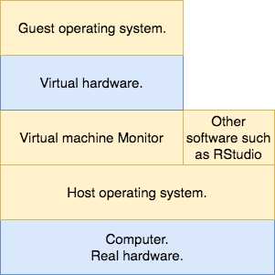
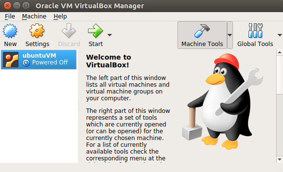
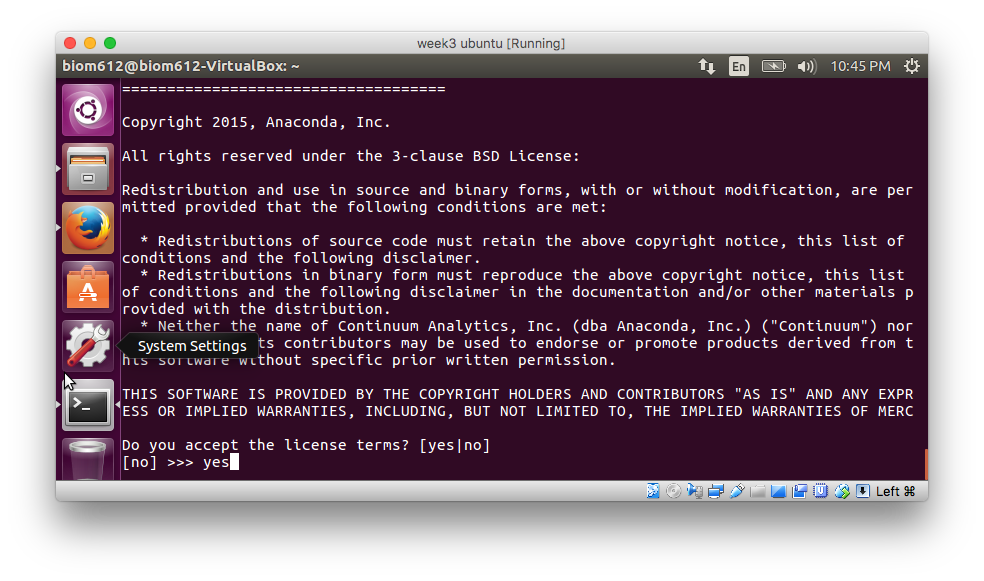

```{r setup, include=FALSE}
knitr::opts_chunk$set(fig.align="center")
```

When you program in the biological field, you will usually encounter the Linux operating system, because most of the biological data analyses that require programming are performed on remote Linux servers through connections from local computers. This write-up introduces the basics of Linux operating system in the context of biological data analysis. 

# Run Linux operating system on a virtual machine

In this section, we will discuss the pros and cons of using Linux operating system. If you are interested, we are going to create a virtual machine on your computer to run Linux. Don't worry, we are not going to ask you to erase all data on your hard drive. 

Linux operating system is developed based on the Unix operating system, so as the Mac OS. Following is the pedigree of Unix based operating system. Image credit: <https://en.wikipedia.org/wiki/MacOS>:

> 

On the other hand, Microsoft Windows is not based on Unix. 

## Unix based operating systems are better for programming in the biological field

You might wonder what is the difference between Linux, Mac OS, and Windows, because they all look the same. Even when you program using an IDE, such as RStudio, things might look the same to you as well. Thus, why bother switching to Linux. 

Firstly, it is not very easy to run some bioinformatics tools on Windows. For example, a popular aligner [STAR](https://github.com/alexdobin/STAR/tree/master/bin) only provides ready-to-run executable files for Linux and Mac OS. If you would like to run it on Windows, you need to compile the executable from source code, which is sometimes very difficult. 

> 

In addition, `bash` script, <https://en.wikipedia.org/wiki/Bash_(Unix_shell)>, is very popular among bioinformaticians to do some simple data analysis, but it can only be easily run on Unix based systems. You might find answers to your programming questions written in `bash` script, such as the following one on BioStars <https://www.biostars.org/p/193471/>. The answers are all bash scripts. 

Most importantly but might not be very familiar to you, the high performance computing servers or clusters are mostly running Linux operating system. If you want to use these resources, you need to learn `bash` script. It is also very necessary to be able to use these resources in some cases. For example, you have 50 human RNA-Seq raw data set from your sequencer, which is about 250GB of data, and you want to align them back to the reference genome. It might take days even weeks to complete this on your own computer. However, if you run them parallel on a server or cluster using 50 high performance CPUs and a large amount of memory, it can be done within several hours. 

Following is a list of a few general advantages and disadvantages of Unix based systems, 

* Advantages:
    - Most educational resources of programming use Unix based operating systems. 
    - Free. 
    - Fast.
    - Almost never freeze. 

* Disadvantages:
    - It is easier to wreck your system by a mistake, and it will be very time consuming or impossible to recover. 
    - Have to learn a lot of things to get started. 

We can easily prevent wrecking our real operating system by using a virtual machine. If you mistakenly wrecked the virtual machine, just delete everything in it and create a new one. Therefore, if you have already been using a Unix based operating system, you can still benefit from running another one on virtual machine. 

## Run Linux on virtual machine

A virtual machine is a guest operating system (OS) running on the host OS through virtualizing the hardware resources. When you start your computer, the host OS runs on the hardware of your computer, such as CPU, memory, and network card. When using virtual machine monitor (VMM), you are able to run a guest OS of any kind on your host OS. The VMM uses software resources provided by host OS to simulate a set of hardware resources for guest OS to run. In the following illustration, real and virtual hardware layers are labeled in blue, and software layers are labeled in yellow. 

> 

There are many VMM applications, and the most popular ones are the costly [VMware products](https://www.vmware.com/products/personal-desktop-virtualization.html) and the free [VirtualBox](https://www.virtualbox.org/).

Following are the instructions to use VirtualBox for running Linux as a virtual machine:

1. Download VirtualBox installer from <https://www.virtualbox.org/>. Click `Download`. Download VirtualBox platform package according to your operating system. 

> 

2. Open the downloaded file and follow the instructions to install. When prompted to install some other stuff, choose install. 
3.  Download `Ubuntu 16.04.3 LTS` image from <https://www.ubuntu.com/download/desktop>. Wait for the file `ubuntu-16.04.3-desktop-amd64.iso` to be downloaded. **Important**: make sure that the there is `amd64` in the file name you are downloading, and it means that the image is a 64-bit version. 
4. Open the installed VirtualBox software. You should see a window similar as following.

> 

5. Click `New` in the window. Fill the name with `ubuntuVM`. **Important**: make sure that the type is **Linux** and Version is **Ubuntu (64-bit)**. Click Continue. **Troubleshoot**: If you cannot find the `64-bit` option, try google for `32-bit ubuntu image` and downloaded it. Then, in `step 16`, use the `32-bit` image. 

> 

6. Click `Continue` to set the memory size of the virtual machine we are creating as recommended.

7. Choose `Create a virtual hard disk now` and click `Create`. This creates a file on your host OS to store the files in guest OS. 

> 

8. Choose `VDI (VirtualBox Disk Image)` and click `Continue`.

> 

9. Choose `Dynamically allocated` and click `Continue`. It worth taking time to read through the explanation in the window.

> 

10. Choose the location of the guest virtual machine to be stored.
11. Change the size of the virtual hard disk to 20-50GB depending on the free space of your computer. Click `Create`. 

> 

12. You should see the newly created virtual machine in the list. 

> 

13. Select the newly created virtual machine and click `Settings`.

> 

14. Select `Storage`. Click the `Empty` under `Controller: IDE`.

> 

15. Click the small disk label in the marked with red rectangle in the previous image. 

> 

16. Select `Choose Virtual Optic Disk File...` and choose the Ubuntu image you downloaded in step 3. You should see the information updated similarly as following. 

> 

17. Click OK. 

18. Select the virtual machine and click `Start`. 

> 

19. Click `Install Ubuntu`. 

20. Select `Download updates when installing` and continue. 

21. Select `Erase disk and install Ubuntu`. Don't worry. This will not erase your real hard drive. This is only going to erase the virtual disk we created. 

22. Click `Continue`. Set up your time zone. Choose language. You might need to enlarge the window to click `Continue`. 

23. Set username and password. **Important**: remember your password. Click `Continue`. Then, wait for the guest OS to be installed on your virtual machine. 

24. Once the installation is done, click `Restart Now`. Similarly, this will only restart the virtual machine but not your real machine. 

24. When you see the instruction to `remove the installation medium and restart`, remove the Ubuntu image from the virtual optic drive similarly as steps 13 - 17. By default, VirtualBox should have removed the image. Restart. **Troubleshoot**: if your virtual machine stuck at a black scree with a few white dots, click menu `Machine -> Reset -> confirm reset`. Wait for a while, and hopefully you will see the log in screen. If it does not work, try delete the created virtual machine and redo the guest OS installation steps started from step 5.  

25. Enter the password to log in. After this step, your virtual machine is up and running. 

**Note**: The following steps are optional but recommended, which allows you to copy and paste text between host and guest. This is usually a very useful feature. 

26. Click the menu `Device` in the window running the virtual machine. 

27. Click `Install guest additions CD image...`. You should see a disk show up in your virtual machine and click `Run`. Then type in the password you set up for your **virtual machine** to authenticate. 

> 

28. Wait for the installation to be done. Following the instruction to hit `return` to close the window. 

29. Click menu `Device -> Shared Clipboard -> Bidirectional`. This will work after restarting the virtual machine. 

30. Restart your virtual machine by clicking the upper right corner and select `Shutdown`. Then choose restart at on the left. 

> 

31. Try copy some text on your host machine and paste to your guest machine `Firefox` browser. It should work if everything went well. I have tested it on both `Mac OS 10.12.6 (16G29)` and `Windows 10`. **Trouble shoot**: If this does not work, try restart virtual box. 


## Note on suspending and waking up Ubuntu virtual machine

After suspending your Ubuntu virtual machine, you might not be able to wake it up again by clicking or typing in the VirtualBox window. You will see a black screen like the following after suspending your virtual machine: 

> 

In order to wake up the virtual machine, you can try to send "ACPI Shutdown" signal to it by clicking menu `Machine -> ACPI Shutdown (Host + U)` as following:

> 

Hopefully, this will wake up the virtual machine. If you found your virtual machine Internet is disconnected, try suspend it and wake it up by sending `ACPI Shutdown`. If this does not reconnect your virtual machine, you might have to restart it. 

In order to avoid these complexities, you can change the setting of your Ubuntu virtual machine so that it will never automatically suspend. Following are the instructions to do that:

1. Open "System Settings":

> 

2. Choose "Brightness & Lock":

> 

3. Change "Turn screen off when inactive for: " as "Never". 

> 


# Install R and RStudio on Ubuntu 16.04

## Instructions for installing R

1. Select your ubuntu virtual machine in VirtualBox and start running it. 

> 

2. Log in to your virtual machine.

3. Open "terminal" in your virtual machine. Terminal is a program to help you interact with your operating system by typing, which is similar to the console tab in RStudio. We will explain more about Terminal in following sections. Here, we are just going to use it for installing R and RStudio. 

> 

4. Type `sudo apt-get update` and hit "return" in the terminal. Then, type in your virtual machine password and hit "return". `sudo` is a command to run the following instructions as superuser, which basically gives you the permission to change certain protected files. `apt-get update` updates the package information from the printed sources (repositories). These sources contain software packages for you to install easily. Be ***careful*** before running something with `sudo` at first, because it will allow the following command to do anything, such as allowing some others to control your machine. 

> 

5. Type `sudo apt-key adv --keyserver keyserver.ubuntu.com --recv-keys E084DAB9` and hit "return" in the terminal. This line of command adds a public key `E084DAB9` to your operating system as a trusted source of package. This key is provided by CRAN at <https://cran.r-project.org/bin/linux/ubuntu/>. Be careful when adding a key from the internet, because it might not be a trusted source. 

> 

6. Type `sudo add-apt-repository 'deb [arch=amd64,i386] https://cran.rstudio.com/bin/linux/ubuntu xenial/'` and hit return. This adds <https://cran.rstudio.com/bin/linux/ubuntu> as a source (repository) of packages. If you are nor running ubuntu **16.4**, you need to change `xenial/` to the version code of your operating system. 

> 

7. Type `sudo apt-get update` again to update the package information. 

> 

8. Type `sudo apt-get install r-base` and hit return. This installs R on your virtual machine. 

> 

9. Type `Y` and hit return. This confirms installation of R. 

> 

10. Type `sudo apt-get install libcurl4-openssl-dev libxml2-dev` and hit return. This installs some libraries that you will need when installing packages in R.

> 

11. Type `R` and hit return. This runs an R interpreter session in your terminal. If you see the following image on your virtual machine, you already have R installed. 

> 

12. If you want to exit R, type `ctrl+D` together. Type `n` and hit return to exit without saving current work space.

> 

## Instructions for installing RStudio

1. Go to RStudio's website and download installer for ubuntu **16.04+**. If you are running a 32-bit ubuntu system. 

> 

2. Go to your downloads folder. Right click the downloaded file. Rename the downloaded file into `rstudio-xenial-amd64.deb`. Make sure that the file name is exactly `rstudio-xenial-amd64.deb`.

> 

3. Open terminal and run `sudo apt-get install gdebi-core`. This installs `gdebi` utility, which will be used to install RStudio. 

> 

4. Run `sudo gdebi -n ~/Downloads/rstudio-xenial-amd64.deb`. This uses `gdebi` to install RStudio. `-n` is an option of `gdebi`, which means we want to install the following file. `~/Downloads/rstudio-xenial-amd64.deb` is the path to the installer you downloaded. `~` in the path refers to your "home". 

> 

5. Open RStudio. Make sure there is no error. 

> 

6. You should see the familiar RStudio interface. 

> 


7. Install CRAN and Bioconductor packages as described in the required section of lab 1 handout. 


# Execute a program in terminal

When you want to analyze a "raw" dataset, such as the sequencing reads generated by your server, you usually can find some software developed by others to perform your analysis. There are basically three ways to run that software on your computer or server: 

1. Directly run a Linux binary file provided by the software developers. This is very easy. You just need to download the binary file and execute it. 

2. Compile the source code of the software into a binary file on your computer, and then execute the compiled binary file as the first method. This can much more difficult. Therefore, always look for a binary file before starting to compile the source code. 

3. Use [Conda](https://conda.io/docs/index.html), a package manager, to "install" the software. This is always the best option if available. 

In this section, we will introduce all three methods by installing a popular RNA-Seq aligner `STAR` [@dobin_star:_2013] as an example. 

## Directly run a Linux binary file

If you go to the GitHub page of STAR, <https://github.com/alexdobin/STAR>, you will see a web-page look like the following screenshot. The files of this software are listed in the upper rectangle of the following image. The text below it is a short introduction of this software, which is the formatted content of `README.md` in the file list. If you go through the `README.md` carefully, it surprisingly does *not* show you how to run their software (checked on Jan 17, 2018). What makes things more confusing is that the page shows you how to compile from the source code, so that you might think it is necessary to compile their source code and then start doing it. 

> 

However, you can find the binary files under the `bin` directory. Go to `bin -> Linux_x86_64_static -> STAR`. Then, download the file to the `Downloads` folder. 

> 

Make sure that there is a file called STAR under the `Download` folder.

> 

Then, open your terminal run `chmod +x ~/Downloads/STAR` and `~/Downloads/STAR --version`. You should see the following output in your terminal:

> 

- `chmod +x ~/Downloads/STAR` gives execution permission (`+x`) to the downloaded file `~/Downloads/STAR`. After executing this line, `STAR` becomes executable, and it can be called as a binary executable file. Most of the times, you only need to know `chmod +x` gives a file execution permission. If you are interested in other file permissions, you can look at <http://linuxcommand.org/lc3_lts0090.php>.

- `~/Downloads/STAR --version` executes the file `~/Downloads/STAR` with an option `--version`. `--version` option asks the `STAR` binary to print out its version. 

There are more options that you can provide when executing `STAR`. You can look up those options in their manual or the help message of the binary file. To get the help message, run the software without any option, the binary file will print out a (very long) help message. Multiple options are separated by spaces. 

If you want to run some other software using this method, look for the `bin` or `binary` directory or link in the website of that software. If you are lucky, you can find a binary to run. 

## Compile binary executable file from source code

This section only shows how compiling source code can be difficult, so you do not need to follow the instructions. 

Let's follow the instructions on the `STAR` GitHub page to compile the source. 

> 

It first asks us to run the following commands in the terminal:

```
# Get latest STAR source from releases
wget https://github.com/alexdobin/STAR/archive/2.5.3a.tar.gz
tar -xzf 2.5.3a.tar.gz
cd STAR-2.5.3a
```

Then, we do not need to use the alternative approach.

Then, run the following:

```
# Build STAR
make STAR
```

It gives us an error as following:

> 

Then, we figured out that we need to change our current directory to `source` before running `make STAR`. We change the current directory using the command `cd`, and we will talk more about commands in the last section.

```
cd source
make STAR
```

It worked this time, and a `STAR` binary executable file is generated in the current directory. You can execute it by running `./STAR --version`. 

Even though we encountered one error in the compiling process, this is actually much easier than many other software. Sometimes, you need to do the following things before getting the binary file:

- Install other required software. This can lead to other troubles. 

- Change compiler parameters. This is the most difficult situation, because you need to understand the basics of a C/C++ compiler. It usually takes a full semester course to learn how a C/C++ compiler works. If you do not have good understanding of a C/C++ compiler, you may or may not be lucky enough to have all parameters set correctly. 

- Handle weird errors given by the compiling process. The errors might depend on your operating system or some other software. For example, the compiling process might require you to have a certain software with version `>= 3.x.x`, but you only have it under version `2.x.x`, so you have to upgrade it. 

To conclude this section, remember: only compile source code when there is no other option available. Most of the times, you will have other options available on Linux. 

## Install the software using Conda

[Conda](https://conda.io/docs/index.html) is a software for managing other software/packages, such as installing, uninstalling, upgrading, and downgrading. 

However, we still need to install Conda. Go to <https://conda.io/miniconda.html> on your virtual machine to download the 64-bit Python 3.6 Linux installer. 

> 

After downloading the installer, make sure that its file name is called `Miniconda3-latest-Linux-x86_64.sh`. If not, you might have downloaded the wrong installer. If you are sure that you downloaded the correct one, rename it to `Miniconda3-latest-Linux-x86_64.sh`. 

Following is the instructions to install `Conda`:

1. Open your terminal and run: `chmod +x Downloads/Miniconda3-latest-Linux-x86_64.sh` and `~/Downloads/Miniconda3-latest-Linux-x86_64.sh` .

> 

2. Hit `enter` to continue. 

> 

3. When you see the `Lincense Agreement` as the following screen shot, hit `q` on your keyboard. 

> 

4. Then, type `yes` and hit return to agree with the license terms. 

> 

5. Hit "enter" to continue. This sets the installation directory to `/home/yourUsername/miniconda3`.

> 

6. **VERY IMPORTANT**: Type `yes` and hit `return`. This enables "terminal" to find the installed conda and other packages installed through conda. 

> 

7. Troubleshooting: If you mistakenly hit `return` before typing `yes`, its default is `no`, and you can execute the following command **exactly** to fix it: `echo "export PATH=\"$HOME/miniconda3/bin:\$PATH\"" >> .bashrc` . **Important**: make sure that you have `>>` rather than a single `>`. This fix assumes that you followed the step 5. If you specified another path for installing conda in the step 5, change `$HOME/miniconda3` in the command to the absolute path you specified.

> 

8. Quit and start terminal again. 

9. Run `conda --version`. You should see the following response:

> 

Now, you have conda installed on your virtual machine. You might feel that this is even more complicated than compiling STAR from the source code. However, you will reap the benefits of installing `conda` when you want to install some other software. 

Next, we use conda to install STAR. Run the following code in terminal: 

```
conda config --add channels conda-forge
conda config --add channels bioconda
conda install star
```

The first two lines add two channels, i.e. software/package repositories, to conda. You only need to do this once. The third line installs `STAR`. 

Type `y` and hit return to confirm installation. 

> 

Run the installed `STAR` by typing `STAR --version` and hit return. Note that you do not need `~/Downloads` at the beginning of `STAR`, because it is now "installed". 

> 

Once you have conda setup, you can install most bioinformatics tools by running `conda install softwareName`. This is extremely helpful when you are setting up an environment on a remote server.

# Basics of terminal

In this section, we are going to cover the following two topics:

- A quick tour of how to use terminal.

- A brief explanation of how terminal works.

## A quick tour of how to use terminal

Open your terminal. To perform our secret practice of `Hello World!`, type `echo 'Hello World!'` and hit return. You should see the following response in your terminal: 

> 

- `echo` is like `print` in R, but `echo` does not require parentheses `()` surrounding its arguments.

- `'Hello World!'` is the string we want to print, and it is taken as the first argument of `echo`. 

In the following tour, we are going to create a new directory called `learn bash` under the Documents directory of your *home* directory. Then, we are going to create a file in it and execute the created file. Finally, we are going to delete the `learn bash` directory we created. 

In the following instructions, the commands are started *after* `biom612@biom612-VirtualBox:~$ `, and the response after executing the command is in the following line(s). The lines started with `#` are comments, which are not executed by bash. 

For example, in the following chunk:

```
# This is a comment.
biom612@biom612-VirtualBox:~$ ls
Desktop    Downloads         miniconda3  Pictures  R          Videos
Documents  examples.desktop  Music       Public    Templates
```

- `# This is a comment` is a comment. 
- `ls` is the command
- The following two lines are the response of `ls`, which lists the files under current/working directory.


`ls` lists the files (including folders) under your current directory. You can specify a directory to list by providing its path as an argument.

```
# List files under Downloads
biom612@biom612-VirtualBox:~$ ls Downloads/
Miniconda3-latest-Linux-x86_64.sh  STAR
```

An important thing to know is that the path `~` is equivalent to the path to your home directory, which is `/Users/yourUserName` in Mac OS.

```
biom612@biom612-VirtualBox:~$ ls ~
Desktop    Downloads         miniconda3  Pictures  R          Videos
Documents  examples.desktop  Music       Public    Templates
biom612@biom612-VirtualBox:~$ ls ~/Downloads/
Miniconda3-latest-Linux-x86_64.sh  STAR
```

Generally, a bash command has the following format:

```
cltname arg1 arg2 arg3 arg4
```

- `cltname` refers to the name of command line tool (CLT).

- `arg1` refers to the first argument passed into the CLT. `arg2` refers to the second argument passed into the CLT. Arguments are optional for most CLTs. 

- Arguments are separated by white spaces. 

By default, the working directory when the terminal starts is you home directory. You can check you current directory using `pwd`, which is similar to `getwd()` in R.

```
biom612@biom612-VirtualBox:~$ pwd
/home/biom612
```

If you want to change your current working directory, you can use `cd`, which is similar to `setwd()` in R. Now lets change our working directory to `Documents`.

```
biom612@biom612-VirtualBox:~$ cd Documents/
biom612@biom612-VirtualBox:~/Documents$ pwd
/home/biom612/Documents
```

The first argument of `cd` is `Documents/`, which specifies the working directory you want to change to. Note that the relative and absolute path rules we introduced in the week 2 lab still can be applied to here. 

Then, we create a directory called `learn bash` in the Documents directory. 

```
biom612@biom612-VirtualBox:~/Documents$ mkdir learn\ bash
biom612@biom612-VirtualBox:~/Documents$ ls
learn bash
```

Note that we have a `\` after `learn`, and this `\` tells bash that the following space is not for separating arguments. Then, bash with take `\` and the space after it as a single space within the first argument. This convention is called escaping of special characters. There are other special characters in bash other than space, but the rules can get quite complicated, <https://www.tldp.org/LDP/abs/html/special-chars.html>. Therefore, the best practice is simply to avoid special characters when naming a file or directory. You can use `a-z`, `A-Z`, and `_` to name all your files. 

If we do not have `\` before a space, the command above will create two directories, one is called `learn`, and the other is called `bash`. 

```
biom612@biom612-VirtualBox:~/Documents$ mkdir learn bash
biom612@biom612-VirtualBox:~/Documents$ ls
bash  learn  learn bash
```

Then, we go to the `learn bash` directory we created. 

```
biom612@biom612-VirtualBox:~/Documents$ cd learn\ bash/
biom612@biom612-VirtualBox:~/Documents/learn bash$ pwd
/home/biom612/Documents/learn bash
```

In this directory, we are going to create a file and print it out. 

```
# Create a file
biom612@biom612-VirtualBox:~/Documents/learn bash$ echo Hello World! > hello_world.txt

# Check the file is there
biom612@biom612-VirtualBox:~/Documents/learn bash$ ls
hello_world.txt

# Print the content of file
biom612@biom612-VirtualBox:~/Documents/learn bash$ cat hello_world.txt 
Hello World!
```

Here, we used a special character `>` to create the file named `hello_world.txt`. The `>` *redirects* the output of `echo Hello World!` into `hello_world.txt`. Here, `hello_world.txt` does not exist before execute the first line of command, so bash will create a new file called `hello_world.txt`. If you already have a file called `hello_world.txt`, it will be overwritten by `bash` with the new content `Hello World!` printed by `echo`. Therefore, you have to be careful when using `>`. 

Then, we use `rm` to remove the created `hello_world.txt`. You can type `h` and hit `tab` key on your keyboard to ask bash to auto-complete your filename.

```
biom612@biom612-VirtualBox:~/Documents/learn bash$ rm hello_world.txt 
biom612@biom612-VirtualBox:~/Documents/learn bash$ ls
# Nothing printed out after we execute ls, because there is no file under
# current directory.
```

Finally, we go to the upper level directory of `learn bash`, i.e. `Documents`, and delete the directories we created. 

```
biom612@biom612-VirtualBox:~/Documents/learn bash$ cd ..
biom612@biom612-VirtualBox:~/Documents$ rm -r learn\ bash/ learn/ bash/
biom612@biom612-VirtualBox:~/Documents$ ls
# Nothing printed out after we execute ls, because there is no file under
# current directory.
```

Here, we have to use `rm -r` to remove a directory, the `-r` option is short for recursively. The following three arguments are `learn\ bash/`, `learn/`, and `bash/`, which are the directories we want to remove. 

This concludes our quick tour of bash. If you would like to learn more about operations in bash, go through the following online book <http://linuxcommand.org/lc3_learning_the_shell.php>, and this is still the best resource I have ever seen to start learning bash. 

After getting the basics, Google for available bash programs (scripts) to perform you analysis. It is generally recommended to only use bash for simple tasks. If you have a complicated pipeline to implement, try to use some other tools such as [`snakemake`](http://snakemake.readthedocs.io/en/latest/).

Personally, I only use bash to:

- Connect to remote servers using [`ssh`](https://www.ssh.com/ssh/command/#sec-Using-the-Linux-client). For more details, check the guide/wiki/tutorial of your department server/cluster, if available. Otherwise, ask the administrator of your department server/cluster. 
- Manage files. 
- Execute programs written in other languages. 
- Copy text locally and paste to a file on remote server using the text editor [`vim`](https://en.wikipedia.org/wiki/Vim_(text_editor)).

## A brief explanation of how terminal works

Note at the beginning: This section might be too technical towards the computer science. Getting familiar with the concepts will be enough.

Terminal is a software application on Ubuntu for running *Bourne Again SHell (Bash)* interpreter, and Bash is a programming (scripting) language designed to operate Unix based operating system (OS) kernels [@noauthor_bash_2017]. If you do not have the graphical user interface (GUI) of Ubuntu installed on your Ubuntu (virtual) machine, a bash interpreter will be started after your operating system starts, and you will not see the log-in graphical interface or mouse cursor. The interface provided by bash or R interpreters is also called command line interface (CLI). 

The above mentioned technical terms are defined as following, and the diagram summarizes their relationships. The definitions are not completely accurate, because some terms have different meanings in different communities. We choose the following definitions to clarify their meanings. 

- OS kernel: A software for operating your hardware through CPU. Linux kernel is written mostly in C programming language, <https://github.com/torvalds/linux>. 

  > 

- OS: A software running on top of OS kernel to help you interact with the OS kernel. This interface can either be GUI or CLI. 

- GUI: Graphical user interface provided by the OS. The GUI you see after starting ubuntu is actually another software running on top of the kernel, which is GNOME Desktop Environment <https://en.wikipedia.org/wiki/GNOME>. It is mostly written in C as well. 
  
  > 

- CLI: The command line interface provided by the OS. Most of the times, CLI refers to Bash interpreter, but other programming language interpreters that execute your code right away can also be thought as a CLI. 

- Bash: A scripting language provides you the CLI to interact with the kernel. The source code of bash can be found here, <http://savannah.gnu.org/projects/bash/>.

- Terminal: An application for running bash on GUI. 

> 

Bash (running in the terminal) helps you to interact with the kernel through command line tools (CLTs). CLTs are software developed using the *system calls* (functions written in C programming language) provided by the kernel. Following are some examples of CLTs and the system calls they used:

- `ls`: list files and directories under current directory, which mainly used the system call [`getdents(2)`](https://linux.die.net/man/2/getdents).

- `cd`: change current directory, which mainly used the system call [`chdir`](https://linux.die.net/man/2/chdir)

- `mkdir`: make a new directory, which mainly used the system call [`mkdir(2)`](https://linux.die.net/man/2/mkdir). Interestingly, the CLT `mkdir` uses the same name as the system call `mkdir`, which is very confusing for the beginners. 

The CLTs executed in bash are binary executable files compiled from the source code. For example, here is the link to the source code of CLT `ls` in Mac OS, <https://opensource.apple.com/source/file_cmds/file_cmds-188/ls/ls.c>, which can be compiled into the binary executable file `ls` for us to execute in `bash`.

You might wonder: Where are the CLTs on my computer? Why can I execute the CLTs? How are CLTs executed? Basically, you can execute the CLTs because they are in your bash "environment". The locations of CLTs are specified by an environment parameter `PATH`, which is similar to the location of R libraries. They are executed by calling the system call [`exec(3)`](http://man7.org/linux/man-pages/man3/exec.3.html).

In the following, we are going to explain environment, `PATH`, and `exec(3)` in more details. 

A Linux environment is the state of the OS and Bash, which is defined by numerous parameters, such as [binary executables](https://en.wikipedia.org/wiki/Executable), [libraries](https://en.wikipedia.org/wiki/Library_(computing)) and [environment variables](https://en.wikipedia.org/wiki/Environment_variable) in Bash. The environment variable `PATH` in Bash is the most relevant to our daily usage, and understanding it would be very helpful for understanding Linux environment. 

Before we explain what is the `PATH` variable, let's first think about the following two specific questions: 

1. How does the Terminal/`Bash` know where to find `ls` after we type `ls` and hit enter? 
2. When there are multiple `ls` binaries, which `ls` will be chosen by `Bash`? 

In order to find out the binary to execute, `Bash` must have a consistent searching mechanism, and this mechanism relies on a `Bash` variable `PATH`. `Bash` variable is similar to `R` variables, and the `PATH` variable is defined implicitly whenever you start a `Bash` interpreter.

Let's first take a look at an example `PATH` variable:

```
$ echo "$PATH"
/home/ubuntu/bin:/home/ubuntu/.local/bin:/home/ubuntu/miniconda3/bin:/usr/local/sbin:/usr/local/bin:/usr/sbin
```

This `PATH` variable stores a list of 6 paths separated by `:`. Each of the individual path refers to a directory on your computer. 

1. `/home/ubuntu/bin`
2. `/home/ubuntu/.local/bin`
3. `/home/ubuntu/miniconda3/bin`
4. `/usr/local/sbin`
5. `/usr/local/bin`
6. `/usr/sbin`

Now let's get back to the searching mechanism for binary executable files in `Bash`. Whenever you type a command and hit enter, `Bash` will search the command in all directories listed in the `PATH` variable from left to right, i.e. 1 to 6 in the list above. The first one that is found will be executed. If no match is found in these directories, an error will be prompted and nothing will be executed. 

A useful command is `which`, which searches through the `PATH` for its first argument. 

Examples:
Search where is `ls`:

```
$ which ls
/bin/ls
```

`ls` is equivalent to `/bin/ls`:

```
$ ls
directory1  file1.txt  file2.txt  file3.txt

$ /bin/ls
directory1  file1.txt  file2.txt  file3.txt
```

Note that `/bin/ls` directly refers to the binary executable of command `ls` without searching. 

After the binary executable file is found, bash requests the OS kernel to execute it by calling the `exec` system call. `exec` is a function written in C programming language, and it does the following two things:

1. Load the machine code stored in the compiled binary executable into your computer's memory.

2. Execute the loaded machine code from beginning to the end.

A complete understanding of the Linux environment requires a deep understanding of multiple complex topics, mainly:

- C programming language.

- Compiling process of C programs, especially assembly and linking.

- Operating system. 

Explore them one by one if you are interested. A good resource is CMU 15-213, <http://www.cs.cmu.edu/~213/index.html>. The course materials are public, such as recorded lecture, slides, and homework assignment. 

# References

