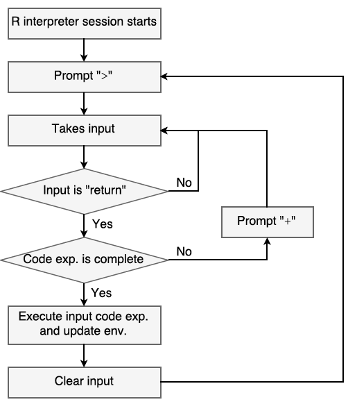

```{r setup, include=FALSE}
knitr::opts_chunk$set(echo = TRUE)
```

1. In the "Run RStudio" section, the R interpreter loop figure:
    + Updated flow chart: 
    
    > 
    
    + If a code expression is not complete (second diamond), R interpreter will prompt "+" before taking extra input.
    + After R interpreter clears the input (bottom rectangle), it prompts ">" to take the next input rather than goes to the start.

2. In the "String index" subsection of the "Data Frame" section:
    + "# Select all 4 rows and columns" should be "# Select all 3 rows and 4 columns".
