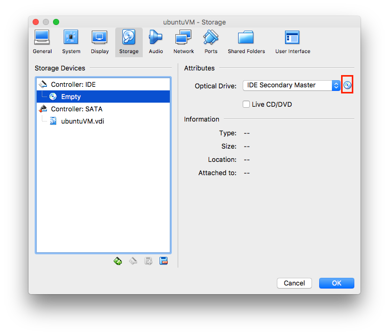
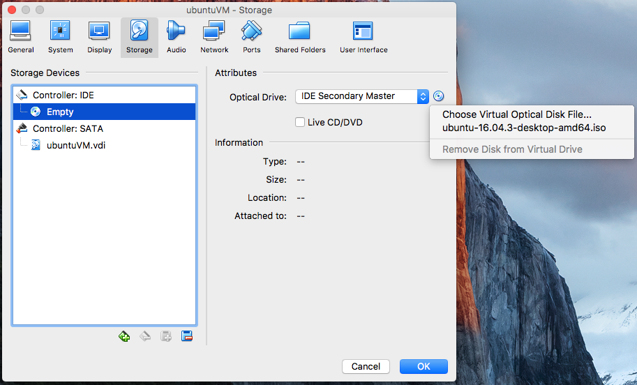
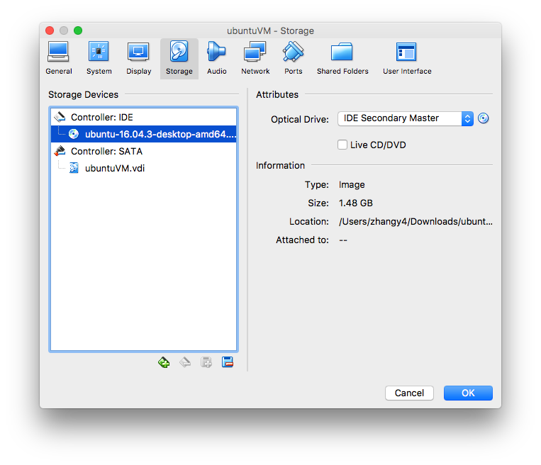

```{r setup, include=FALSE}
knitr::opts_chunk$set(fig.align="center")
```

This handout covers the topics that we will go through during the lab session. 

There are two main sections in this handout, required and optional. 

* The required section covers the topics listed in the syllabus. 
* The optional section covers some other useful topics in case the lab session ends too early. 

In the required section, we are going to set up R and RStudio on your computer. After getting R up and running, we will briefly go through the basic syntax and data types of R programming language. Then, we are going to learn how to use R packages and create R Markdown files. Then, we are going to go through the basics of R programming by analyzing a simple biological data set. Finally, we conclude the required section by discussing the advantages of using R for data analysis comparing to Excel. 

In the optional section, we are going to run Linux operating system on a virtual machine. 

# Required

## Install R programming language

1. Go to <https://www.r-project.org/>. 

2. Click `download R` in the `Getting Started` section.

> {width=70%}

3. Click <https://cloud.r-project.org/>, the first link under **0-Cloud**. The URLs to the mirrors of Comprehensive R Archive Network (CRAN) are listed in this page. A mirror is a replicate of the contents of the main server, of which the URL is <http://cran.r-project.org>. Therefore, you can choose any of the URLs listed if you want. 

> {width=50%}

4. Choose the download link based on your operating system. 
    + Linux: Choose your Linux distribution and follow the installation instructions.
    + Mac OS X: Download `R-3.4.3.pkg`. Open the downloaded file to install. 
    + Windows: Choose `base`, then `Download R 3.4.3 for Windows`. Open the downloaded file to install. 

## Install RStudio

1. Go to <https://www.rstudio.com/products/rstudio/download/#download>. 
2. Choose the installer to download based on your operating system. For Linux users, check if you are running 32-bit or 64-bit system.
3. Open the downloaded file to install. If you are running Ubuntu, you might need to install by using the `gdebi` utility, and you can find more information at <https://medium.com/@GalarnykMichael/install-r-and-rstudio-on-ubuntu-12-04-14-04-16-04-b6b3107f7779>.

Note on 32-bit and 64-bit:  Most of the time, we only need to know this information when trying to install or run some software. 32-bit or 64-bit refers to the size of register in the central processing unit (CPU). [32-bit](https://en.wikipedia.org/wiki/32-bit) system allows direct access of $2^{32}$ bytes of memory, and [64-bit](https://en.wikipedia.org/wiki/64-bit_computing) allows direct access of $2^{64}$ bytes of memory. 

## Run RStudio

1. Open the installed RStudio. If all went well, there should no error message, and there should be several panes. 
2. Find the pane with the `Console` tab in it and select that tab, which is the left pane by default if you have not opened any script yet. The console runs an R programming language interpreter, which executes the R code for you.

> 

3. Select the `Console` pane by clicking on its inner area. You should see a cursor blinking after the prompt `> `.

4. Type `print("Hello World!")` and hit enter. You should see the following prompt in the next line `[1] "Hello World!"`. An R base function `print()` is called with the positional parameter `"Hello World"`. After this line of code is executed, the parameter is printed by the computer to the console. 

> 

Even though this line of code is simple, there are actually many things happened behind the scene:

1. RStudio starts running. RStudio is an integrated development environment (IDE) for R programming language. RStudio is written mainly in Java, C++, and JavaScript. You can look at their source code stats if you are interested by going to the following link, <https://github.com/rstudio/rstudio>. 

2. RStudio runs R programming language interpreter and shows its output in the `Console` tab. The R programming language interpreter is basically an infinite loop with memory of executions within the same session:
    + Prompt `> `.
    + Takes in code expression. 
    + Executes the code expression. When execution is done, prompt `> ` again and ready for the next code expression. However, if one or more variables are created or updated, the interpreter will remember them.

> 

3. You typed in `print("Hello World!")` and "enter" in the R interpreter.

4. When R interpreter sees the "enter", it checks your code before the "enter". If you wonder why this is necessary, try type `print("Hello World!"` and "enter". Note that the `)` is missing at the end. Then, at the next line with the prompt `+ `, type `)` and "enter". The `)` in the second line completes the code expression, and the R interpreter starts executing the code expression. 

5. R interpreter found a complete code expression and starts executing the code without the "enter".

6. R interpreter starts executing `print("Hello World!")`, which is a function to print data out. **At this point**, the prompt `[1] "Hello World!"` is printed out. Question: why is there `[1] ` before `"Hello World"`? Hint: try to run `print(1:100)`, where `1:100` creates a vector of integers from 1 to 100.

7. `print("Hello World!")` function returns `"Hello World!"`, but there is no variable assigned to that return value. Try to run `myVariable <- print("Hello World!")` and see what the value is stored in `myVariable`. You can see it either by typing `myVariable` and "enter" in the console, or find it in the `Environment` tab of another pane. Environment is basically a collection of variables. 

8. R interpreter evaluation loop resumes running to take in the next code expression. If you would like to see the suspension of R interpreter evaluation loop, try to run `Sys.sleep(10)` which asks the interpreter to idle for 10 seconds. You should see a blinking cursor at the beginning of the line. Try:
    + When the evaluation loop suspends, type in `print("Hello World!")` and "enter". 
    + When the evaluation loop suspends, hit "esc". 

## R basic syntax and data types

In this section, we are going to briefly go through the basic syntax and data types of R programming language.

Syntax:

* Arithmetic operations
* Variables
* Functions
* Logical operations
* if-else statement
* Loop

Data types:

* Vectors
* Factors
* Matrices
* Data frames

### Syntax

#### Arithmetic operations

You can use R interpreter as a calculator.

Note: `#` starts a comment, `#` and everything afterwards within the same line are not going to be executed. 

```{r arithmatic, eval=TRUE}
1 + 1
2 * 3 # Calculate 2 times 3
5 / 9 # Calculate 5 divided by 9
5 %/% 9 # Calculate 5 divide by 9 using integer division
2 ^ 3 # Calculate 2 to the 3rd
log(8, 2) # Calculate log, base 2, of 8.
10 %% 2 # (x modulo y)


# Following is some advanced stuff, aware of them is enough
1 / 0 # Result is `Inf’, which means positive infinity
-1 / 0 # Result is `-Inf’, which means negative infinity
0 / 0 # Result is `NaN’, which means not a number
```

#### Variables

Most of the times, we want to keep the results of some code expressions and use them somewhere else.

```{r variables, eval=TRUE}
# variable1 keeps the result of 25 * 25.
# "<-" is the convention for assigning value to a variable.
# I recommend you to not use "=" for variable assignments.
variable1 <- 25 * 25

# This prints out the value in variable1
variable1

# variable2 keeps the result of variable1 * 25, i.e. 25 * 25 * 25.
variable2 <- variable1 * 25 
variable2

# variable1 is updated to 25 * 25 / 25
variable1 <- variable1 / 25
variable1

# Advanced
# Although = can also be used, = is mostly used in specifying
# parameters in a function.
var3 = 3 # Not good in R coding convention, but will work.
var3

var3 * 5

log(2, base = 3) # "base = 3" is good in R coding convention.
```

#### Functions

Motivation: keep some analysis procedures somewhere for later usage. Sometimes you may find writing R code is tedious because of a lot of copy and paste.

```{r functions anti-pattern, eval=TRUE}
# Want to do the same transformation for 3 different variables
var1 <- 10
var2 <- 20
var3 <- 30

# **Anti-pattern**: code without using functions
var1 <- ((var1 * 20 + 5) / (30 * var1)) ^ 2 * var1 * 3 + 200 # Just to make the code complicated
var1
# Copy the code and paste 2 times and change var1 to var2 or var3
var2 <- ((var2 * 20 + 5) / (30 * var2)) ^ 2 * var2 * 3 + 200
var2

var3 <- ((var3 * 20 + 5) / (30 * var3)) ^ 2 * var3 * 3 + 200
var3
```

Although this does not look too bad, things may get much worse in real analysis, because we need to think about everything that needs to be changed. Thinking about this is stressful and error prone.

However, we can rewrite the code using a function to make it simpler.

```{r functions, eval=TRUE}
var1 <- 10
var2 <- 20
var3 <- 30

veryComplexTransformation <- function(var) {
  result <- ((var * 20 + 5) / (30 * var)) ^ 2 * var * 3 + 200
  return(result)
}

# This line calls the function by using var1 as "positional argument", where
# R interpreter use the value in var1 as the argument var in the function
var1 <- veryComplexTransformation(var1)
var1

# This line calls the function by specifying the argument using "key-value" 
# format. The key is the argument name "var" defined in the function, and 
# the value is "var2" provided by us.
var2 <- veryComplexTransformation(var = var2)
var2

var3 <- veryComplexTransformation(var = var3)
var3
```

Although we still need to copy and paste, it is easier to figure out where needs to be changed.

#### Logical operations

Sometimes we want to check a "statement" is either true or false. This is mostly used together with if-else statement and loop introduced in the next two sections. 

```{r logical ops}
var1 <- 10
var2 <- 20

!TRUE           # !: logical NOT. 
!FALSE
# "!" is usually read as bang in logical operations.

TRUE & FALSE    # &: logical AND
TRUE | FALSE    # |: logical or

var1 == var2    # ==: test whether the value of var1 is EQUAL to the value of var2
# **IMPORTANT**: "var1 == var2" (test equality) is different from 
# "var1 = var2" (variable assignment)

var1 != var2    # !=: test whether the value of var1 is NOT EQUAL to the value of var2

var1 < var2     # <: test whether the value of var1 is LESS THAN the value of var2
var1 <= var2    # <=: test whether the value of var1 is LESS THAN OR EQUAL TO the value of var2

var1 > var2     # >: test whether the value of var1 is GREATER THAN the value of var2
var1 >= var2    # >=: test whether the value of var1 is GREATER THAN OR EQUAL TO the value of var2

# Advanced
# Define var3 as a numerical vector containing 10 and 15.
var3 <- c(10, 15)

var1 %in% var3  # %in%: test whether the value of var1 is CONTAINED IN the value of var2
var2 %in% var3

# Special values
is.na(NA)

is.nan(NaN)

is.infinite(-Inf)
is.infinite(Inf)
```

#### if-else statement

Sometimes we want to perform different procedures on different cases. 

```{r if else}
var1 <- 10
var2 <- -10
var3 <- 0

getAbsoluteValue <- function(var) {
  if (var > 0) {
    return(var)
  } else if (var == 0) {
    # This case is redundant, which is intended to show the complete syntax.
    # This case can be merged with the previous case to form "var >= 0"
    return(var)
  } else {
    return(-var)
  }
}

getAbsoluteValue(var1)

getAbsoluteValue(var2)

getAbsoluteValue(var3)
```

#### Loops

Sometimes we want to repeat a procedure for certain amount of times.

```{r loop}
var1 <- 10
var2 <- 9

# Use a for-loop to calculate a value * 10
times10ForLoop <- function(var) {
  varTimes10 <- 0
  
  for (i in c(1, 2, 3, 4, 5, 6, 7, 8, 9, 10)) {
    # do this for 10 times
    varTimes10 <- varTimes10 + var
  }
  
  return(varTimes10)
}
times10ForLoop(var1)
times10ForLoop(var2)

# Use a while-loop to calculate a value * 10
times10WhileLoop <- function(var) {
  varTimes10 <- 0
  numberOfLoopLeft <- 10

  while (numberOfLoopLeft > 0) {
    numberOfLoopLeft <- numberOfLoopLeft - 1
    varTimes10 <- varTimes10 + var
  }  
  
  return(varTimes10)
}
times10WhileLoop(var1)
times10WhileLoop(var2)
```

### Data Types

#### Vectors

Sometimes we want to store multiple values in one single variable rather than multiple individual ones. The easiest way is to store all values in a vector variable, and you can access each of them through that vector variable. 

Vectors are a basic data type in R. Most everything you will be operating on in R is a vector. To create a vector in R, one way is to use the '`c`' function, which stands for 'combine'. 

To create a vector and access values in it:

```{r create vector}
myvec <- c(10,20,30)
myvec

# This access the first value in the vector. 
# The "1" within [] is the index.
# Indexing is explained for more details in the data frame section.
myvec[1]

myvec[3]

# You can also select two values to make a new vector
myvec[c(1, 2)]
```

However, you will **not** be able to do this without the combine function. (note the missing '`c`' in front of the parenthesis!)

```{r create vec wrong syntax, error=TRUE}
myvec <- (1,3,4,5)
```

In R programming language, there is no such thing as a 'naked' value, such as a single number or a single character, which means a single value is also wrapped in a vector. For example, `x <- 5` assigns a vector of length 1, which is equivalent to `x <- c(5)`.

Operations on vectors are performed on all elements:

```{r vector ops, error=TRUE}
myvec <- c(1, 2, 3)
myvec + 5
myvec == 2
myvec %in% c(1, 5, 10)
```

Although vectors can contain multiple values, each vector can only contain values in the same type. The following section explains the types of vectors. 

#### Vector types

Vector types are: "logical", "integer", "numeric" (also synonym "double"), "complex", "character" and "raw".

```{r vector types}
myLogicalVec <- c(TRUE, FALSE, TRUE)
myLogicalVec

myIntegerVec <- c(1, 2, 3)
myIntegerVec

myNumericVec <- c(1.1, 2.2, 3.3)
myNumericVec

myComplexVec <- c(complex(real = 1, imaginary = 1), 
                  complex(real = 2, imaginary = 2),
                  complex(real = 3, imaginary = 3))
myComplexVec

myCharacterVec <- c('1', '2', '3')
myCharacterVec

myRawVec <- c(as.raw(1), as.raw(2), as.raw(3))
myRawVec
```

The three most common vector types are "integer", "numeric" and "character".

**Importantly**, vectors are "strictly typed". That is, a vector is only allowed to contain values of one type. 

This behavior of R vectors has **important** consequences, where the type of a vector might be changed after inserting another value of different type without any notification to you. Following is a typical case: if you try to insert a character such as "Hi" into a numeric vector, it will change the entire vector into a character vector. Your numbers will be "coerced" into characters without any notification. 

```{r vec coersion}
myNumericVec <- c(1, 2, 3)
myNumericVec

# You can "concatenate" vectors using the function c() as well.
# Recall that a single value is also a vector.
myNewVec <- c(myNumericVec, "Hi")
myNewVec
# Note that the previous number 1, 2, and 3 not become strings "1", "2", and "3", 
# i.e. they are now in character type
```

Some frustrating errors can happen that way, where your calculations are not working because your vector is a character not a number --  which is why you need the function `class()` to help you figure out what you're working with. R cannot do numerical calculations on a character vector.

```{r data type examples, error=TRUE}
# character vector
# Note that a string in R can be defined by either " or ', 
# i.e. "a" is equivalent to 'a'.
myCharVec <- c("a", 'b', 'c')
myCharVec

class(myCharVec) # class of an R object

# number vector
myNumVec <- c(1, 2, 3, 4, 5, 6)
myNumVec
class(myNumVec)

# fast way to generate a number vector
myNumSpanVec <- c(1:16)
myNumSpanVec

# combine two numeric vectors
myNewVec1 <- c(myNumVec, c(7, 8, 9))
myNewVec1
class(myNewVec1)

# try combine a character vector and a numeric vector
myNewVec2 <- c(myNumVec, c("7", "8", "9"))
myNewVec2
class(myNewVec2)

myNewVec2 * 2
```


#### Factors

The `factor` data type is designed to encode categorical values into numerical values, which is often used to perform certain statistical analysis in R, such as classification. We will discuss the use cases of factors in later sessions. For now, you only need to be aware of the difference between a factor and a character typed vector.

An important note on the factor type is that when reading files into R environment, the default behavior for is to turn all character columns into factors, which can be turned off by specifying `stringsAsFactors=FALSE`. 
Following shows the difference between a factor and a character. We use the function `str()` to display the "structure" of the value inside a variable. 

In the following example, we have a factor of length 10 that only held three different types of items "red", "blue", "green". Factors represent those three different types as 'levels', the levels being ("blue", "green", "red") here in alphabetical order. 

```{r Factors, error=TRUE}
myCharVec <- c("red", "blue", "red", "green", "red", "blue", "blue", 
               "red", "green", "green")
str(myCharVec)

# now let's turn myfactordata into a factor.
myFactor <- factor(myCharVec) 
str(myFactor)

myFactor
myFactor[2]
str(myFactor[2])

# Lists all levels of a factor
levels(myFactor)

# You will only receive a warning message by doing arithmatic operations on 
# factors, because they are inherently numbers. 
myFactor + 1

# You will receive an error by doing arithmatic operations on character typed 
# vectors
myCharVec + 1

as.numeric(myFactor)
as.numeric(myCharVec)

c(myFactor, 10)
c(myCharVec, 10)

c(myFactor, 'red')
c(myCharVec, 'red')

c(myFactor, 'someOtherColor')
c(myCharVec, 'someOtherColor')

```

#### Matrices

Matrices are mostly used for performing linear algebra operations. If you simply want to store a table of values into a variable, the data type `dataframe` introduced in the next section might be more appropriate, because it offers more "table-like" features than matrices. 

Matrices are strongly typed arrays values, which means that the values in one matrix can only have one type. Vectors can be coerced into matrices. Many R functions require matrices and will not accept data frames. We will be discussing matrices throughout the course, so we will simply introduce them here.

```{r matrices}
# matrices are arrays of a single type (either number, or character...)
myMatByCol <- matrix(c(1:16), nrow=4, ncol=4)
myMatByCol

# another way to arrange a matrix.
myMatByRow<-matrix(c(1:16), nrow=4, ncol=4, byrow=T)
myMatByRow

# matrix multiplication
# Note that the operator %*% is used to perform matrix multiplication
myMatByCol %*% myMatByCol

# Elementwise matrix multiplication using operator *
myMatByCol * myMatByCol
```

#### Data Frames

We use `data frames` to represent tables of values. Data frames are better suited for representing tables because they allow columns to have different types. 

A Data frame can be considered as an ordered list of vectors. Each column in a dataframe is a vector, and must have the same length as every other vector in the data frame. 

In the following code example, we are going to create a data frame to represent the clinical response of patients to different treatments.

```{r Data frames}

# Create vectors of values in different types

name <- c("John Smith", "Jane Doe", "Mary Johnson")
treatmentAResponse <- c(5, 16, 3)
treatmentBResponse <- c('good', 'bad', 'bad')

# combine these into a data frame with each row is a patient
# stringsAsFactors = F is used to suppress automatic conversion of strings into
# factors. 
myDf1 <- data.frame("Name" = name, "Treatment A Response" = treatmentAResponse,
                   "Treatment B Response" = treatmentBResponse, 
                   stringsAsFactors = F)
myDf1

# creating a data frame with no labels
myDf2 <- data.frame(name, treatmentAResponse, treatmentBResponse, 
                    stringsAsFactors = F)
myDf2

# create the data in situ in the data frame.

myDf3 <- data.frame(c("John Smith", "Jane Doe", "Mary Johnson"), 
                    c(5, 16, 3), 
                    c('good', 'bad', 'bad'),
                    stringsAsFactors = F)
myDf3
# well that looks terrible!

# let's add some actual names to those columns and rows

colnames(myDf3)<-c("Name", "Treatment A Response", "Treatment B Response")
rownames(myDf3)<-c("Patient 1", "Patient 2", "Patient 3")
myDf3
```

The most commonly used operation on data frame is to pull out certain values by "indexing". We will introduce other methods of pulling out data in the last subsection. 

Indexing is the method of selecting values in data frames by indices, and an index is vector indicating the locations of the selected values in a data frame. 

The syntax of indexing is `myDataFrame[myRowIndex, myColumnIndex]`.

There are four types of indices:

* Number: which row or column by number, such as `c(1, 2, 3)`.
* Logical: select a row or column or not select, such as `c(TRUE, FALSE)`. 
* String: row or column name(s) to select, such as `c(“col1name”, “col2name”)`.
* Blank: leave the index blank to imply selecting all rows or columns.

##### Number indices

```{r num index}
myDf <- data.frame(name = c("John Smith", "Jane Doe", "Mary Johnson"), 
                   treatmentAResponse = c(5, 16, 3), 
                   treatmentBResponse = c('good', 'bad', 'bad'),
                   stringsAsFactors = F)
myDf

# Select all 3 rows and columns
myDf[1:3, 1:3]

# Select the value in the first row and second column
myDf[1, 2]

# Select the value in the second row and first column
myDf[2, 1]

# Select the values in the first 2 rows and the second column
myDf[1:2, 2]

# Use negative numbers to remove certain rows or columns
# Remove the first row and first column
myDf[-1, -1]
```

##### Logical indices

Logical indices are usually generated from a logical operation on the values.

```{r bool index}
myDf <- data.frame(name = c("John Smith", "Jane Doe", "Mary Johnson"), 
                   treatmentAResponse = c(5, 16, 3), 
                   treatmentBResponse = c('good', 'bad', 'bad'),
                   stringsAsFactors = F)
myDf

# Select all 3 rows and columns
myDf[c(TRUE, TRUE, TRUE), c(TRUE, TRUE, TRUE)]

# Select the value in the first row and second column
myDf[c(TRUE, FALSE, FALSE), c(FALSE, TRUE, FALSE)]

# Select the value in the second row and first column
myDf[c(FALSE, TRUE, FALSE), c(TRUE, FALSE, FALSE)]

# Select the values in the first 2 rows and the second column
myDf[c(TRUE, TRUE, FALSE), c(FALSE, TRUE, FALSE)]

# Select all columns of patients with 'bad' response to treatment B
myDf[myDf[1:3, 3] == 'bad', 1:3]
```

**Important**: an error prone behavior of logical index is *recycling*. 

Recycling: when the logical index is shorter than the number of rows or columns, the logical index will be repeated until it reaches the end of rows or columns **without** any notification. 

```{r bool recycling}
# Row index TRUE is recycled into c(TRUE, TRUE, TRUE)
myDf[TRUE, c(TRUE, TRUE, TRUE)]

# Row index c(TRUE, FALSE) is recycled into c(TRUE, FALSE, TRUE)
# Note that the first and tird rows are selected
myDf[c(TRUE, FALSE), c(TRUE, TRUE, TRUE)]

# Examples on vectors:
myVec <- 1:20
myVec

myVec[c(TRUE, FALSE)]
myVec[c(TRUE, FALSE, FALSE)]
myVec[c(TRUE, FALSE, TRUE)]
```

##### String indices 

String indices are similar to number indices but more robust after inserting more columns or rows. After inserting more columns or rows, the number indices of some values might change, but string indices should be the same. The default row names are a vector of string from 1 to n, and here is c("1", "2", "3"). 

```{r string index}
# Now we have a new A treatment, and the column number index 2 does not refer to
# treatment B anymore. 
myDf <- data.frame(name = c("John Smith", "Jane Doe", "Mary Johnson"), 
                   treatmentAResponse = c(5, 16, 3), 
                   treatmentNewAResponse = c(18, 25, 15),
                   treatmentBResponse = c('good', 'bad', 'bad'),
                   stringsAsFactors = F)
myDf

# Select all 4 rows and columns
myDf[c("1", "2", "3"), c('name', 'treatmentAResponse', 'treatmentNewAResponse',
                         'treatmentBResponse')]

# Select the treatment B response of all three patients
myDf[1:3, 'treatmentBResponse']
```

##### Blank indices

If you left row index or column index as blank, it implies all rows or columns are selected.

```{r blank ind}
myDf <- data.frame(name = c("John Smith", "Jane Doe", "Mary Johnson"), 
                   treatmentAResponse = c(5, 16, 3), 
                   treatmentBResponse = c('good', 'bad', 'bad'),
                   stringsAsFactors = F)
myDf

# Select all rows and columns
myDf[,]

# Select all rows and first column
myDf[, 1]

# Select the first row and all columns
myDf[1, ]
```

## Install and use `packages`

An R package is essentially a collection of code for certain purposes, such as performing differential expression analysis ([`DESeq2`](https://bioconductor.org/packages/release/bioc/html/DESeq2.html)), convert R markdown to HTML/PDF/Word ([`Knitr`](https://www.rdocumentation.org/packages/knitr/versions/1.17)), and general plotting ([`ggplot2`](http://ggplot2.tidyverse.org/index.html)). 

In order to better share the code, an R package usually contains the following things as well:

* Tutorials to help users to get quickly started. 
* Reference manuals containing the details about how to use the code for your own analysis. 

In this section, we will go through the following:

* Install packages:
    + Packages from [CRAN](https://cran.r-project.org/) using the `install.packages()` function.
    + Packages from [Bioconductor](http://bioconductor.org/) using the `biocLite()` function. 
* Use packages:
    + **Import** packages using `library()` function.
    + Call functions in packages without importing using the `libraryName::functionName` syntax.
* Get help from documentations

### Install packages

#### CRAN

To install from CRAN, run the following code:

```{r install from CRAN, eval=FALSE}
install.packages("ggplot2")
install.packages("dplyr")
```

If you are calling it for the first time, you might be prompted to select the mirrors, which is the same as downloading R programming language. You can just choose the same one as above <http://cran.r-project.org>. 

`install.packages()` is the function to install package. The first parameter `"ggplot2"` is the name of the package to be installed. 

#### Bioconductor

To install from CRAN, run the following code:

```{r install from Bioconductor, eval=FALSE}
# source() is a function to run an R program. 
# source("https://bioconductor.org/biocLite.R"), runs the script at 
# https://bioconductor.org/biocLite.R , which defines the 
# function `biocLite()`.
#
# You can use your browser to see the code by opening the link. 
source("https://bioconductor.org/biocLite.R")

# Install core packages
biocLite()

# Install a specific package named DESeq2
biocLite("DESeq2")
```

Note: `#` starts a comment, `#` and everything afterwards within the same line are not going to be executed. 

#### Overview 

For both CRAN and Bioconductor packages, the installing process of a package includes basically two steps:

1. Download the package from CRAN or Bioconductor to your computer.
2. Set up downloaded package(s) in one or more locations on your computer. These locations are called the "library" of your R environment, which can be checked using function `.libPaths()`. 

You might wonder why we couldn't just have one repository. Just list a few reasons:

* CRAN and Bioconductor developer communities are distinct. From my impression, the CRAN community focus more on general usage such as plotting and data manipulations, whereas the Bioconductor community focus more on analyzing a specific type of biological data. 

* R packages are peer-reviewed by the community. A general purpose package developer might not be able to review a package specifically designed for biological data. 

* Publishing rules of Bioconductor are more strict than CRAN, which guarantee certain minimum level of package quality. 


### Use packages

The code for using CRAN and Bioconductors is the same. You can either import the whole package to your environment using function `library()`, or execute certain function within a package using the `packageName::functionName` syntax.

```{r use package, eval=TRUE, echo=TRUE, message=F, warning=F, cache=TRUE}
# Run functions using the :: operator
# NOTE: ggplot2::mpg refers to the dataset `mpg` in the package `ggplot2`

ggplot2::ggplot(ggplot2::mpg, ggplot2::aes(displ, hwy, colour = class)) + 
  ggplot2::geom_point()

# Import an installed CRAN package
library("ggplot2")

# Import an installed Bioconductor package
# Note that the quotes are optional
library(DESeq2)

# Run imported functions from ggplot2
# You will get an error if you run this without importing ggplot2
ggplot(mpg, aes(displ, hwy, colour = class)) + 
  geom_point()
```

You might wonder why we still need to import a library after installing it. The intuition is an analogy to installing a software on your computer. After you install a software, such as RStudio, you might not want to open it and keep it constantly running at the background after starting your computer, because that will slow down your computer and make your working space crowded. When R interpreter starts running, it only has a minimum set of data and functions defined, which is similar to a just started computer. If you want to use the R interpreter to do something else, you need to get those data and functions into your environment, which is similar to opening an application, such as a web browser, on your computer. 

However, this analogy does not explain the `packageName::functionName` syntax, and we need more details to understand what really happened. 

Recall that a package is a collection of code structured into a directory located in the R library on your computer. Following is a screen shot of one R library location:

> {width=70%}

Each folder is an installed package with the folder name of corresponding package name, and the `ggplot2` package is the first one in the list. The content of `ggplot2` is structured within the folder. Following is the screenshot of the files within the `ggplot2` folder:

> {width=70%}

All packages are structured in the same way but with different content in these files. The code of a package is stored in the `R` directory, and the datasets are in the `data` directory. Other files and directories contain documentations, license, citation, etc. 

Therefore, using a package, either through importing or `::` operator, is to ask R interpreter to use the stored code or datasets. However, there are important distinctions between these two methods. 

Importing a packages **loads** all code and datasets into your R interpreter, so that you can call the package defined functions and use its datasets directly. However, importing will not execute the loaded code. 

On the other hand, `packageName::functionName` does not load anything into your R interpreter but just **execute** the function. After the executed function returned, the function will not be loaded. 

Because R interpreter starts with only a minimum set of packages imported, if you want to use a function or dataset within a package that has not been imported, you can either import that package and use it directly afterwards, or use it through `::` operator. 

### Get help from documentations

You can get help from two types of documentations, tutorial (vignette) and reference manual. A tutorial helps a beginner to quickly get started using the package, whereas a reference manual lists all the details about the code and datasets included in the package for a more experienced user to look up. 

You can get both tutorial and manual either using RStudio or online. 

#### Get documentations using RStudio 

There are R functions to look up the package documentations in your library (recall the figure of package structure). The function `vignette("packageName")` looks up for tutorial, and `help("functionName")` looks up for the manual section of that function. After the function being executed by your R interpreter and the specified documentation was found, the documentation will show up in the `help` tab in one of your RStudio panes. You will receive an error in the `console` tab if the specified documentation was not found. 

Following is a demo of how to use `vignette()` and `help()` functions.

```{r get docs, message=FALSE, eval=FALSE}
# I want to see the the vignette of DESeq2
# This does not require DESeq2 to be imported
vignette("DESeq2")

# I want to get help on the function DESeq() in DESeq2
# This requires DESeq2 to be imported. If we did not import DESeq2 previously, 
# you will receive an error message. 
help(DESeq)

# However, if you do not want to import DESeq but just want to see the documentation
# of DESeq(), you can use the following code
help(DESeq, package = "DESeq2")

# If you want to know more about these two functions, check their manuals
help(vignette)
help(help)
```

#### Get documentations online

Google the package and go to either CRAN or Bioconductor depending on the package source. Find the documentations listed in the webpage. Following are the screenshots of the location of the documentation:

> 

> 

The first documentation of DESeq2 on Bioconductor *Analyzing RNA-seq data with DESeq2* is the tutorial. 

Documentations are usually very helpful, but also keep in mind that Google is also your best friend when learning programming. There are many helpful Q&As on [StackOverflow](https://stackoverflow.com/) and [Biostars](https://www.biostars.org/). StackOverflow community is focused on general programming and statistics, whereas Biostars community is focused on bioinformatics. 


## R Markdown

R Markdown is a markup language for formatting an analysis report written in R, which allows you to embed your R analysis code into a document explaining your analysis. 

The R package [`knitr`](https://yihui.name/knitr/) converts R Markdown files into an easy-to-read report in HTML, PDF, or Word format. 

To start using R Markdown in RStudio:

1. Click menu `File -> New File ->` **`R Markdown`**. Then, you will be prompted by a window to fill in some relevant parameters. In the `Default Output Format:` option, select [`HTML`](https://en.wikipedia.org/wiki/HTML) (**important**), which is the standard markup language for creating web pages. It worth taking time to read the explanations of each option. After clicking `OK`, a new R Markdown file will show up in a pane of RStudio. 

2. Click the `Knit` option at the top of the Markdown file pane. Then, you will be prompted to save the R Markdown file. If you hit `Knit` for the first time, you will be prompted to install several packages that are required to run the "knitting" process. Install them. 

> 

3. Give the file a name such as `test` and save it anywhere you prefer. Then, you will see an `R Markdown` tab show up in the `Console` pane, and it starts running. When running, `knitr` executes all R code and generates an HTML report. After it is done, a new window containing the generated HTML report will show up. The report file will also be stored in the same directory as the R Markdown file. 

If you want to generate your report in PDF, you will need to install a extra tool on your computer outside of RStudio. This tool, [TeX](https://en.wikipedia.org/wiki/TeX), helps `knitr` to convert R Markdown into PDF. In order to get this tool, click the tiny triangle at the right side of `Knit` option and select `Knit to PDF`, and you will receive an error message in the R Markdown tab. Follow the instructions in the error message carefully to install the TeX distribution. 

We will explore the features of R Markdown in the next section. 

## R basic operations

In this section, we will go through the basics of R programming language by analyzing a simple and fake biological dataset. The dataset is stored in the file `cell_exp_proliferation.csv` within the lab 1 handout. You can open it with a text editor or Excel.

The dataset is collected in an experiment to study the correlation between the expression level of a gene and the proliferation rate of a cell line. In the hypothesis, this gene is able to decrease the proliferation rate of the cells. This dataset includes the expression levels of the gene in wild type, knock down, and over-expressed cells and their proliferation rates. Each condition has 10 biological replicates. Following is the data contained in `cell_exp_proliferation.csv`.

```{r, echo = FALSE}
knitr::kable(read.csv('cell_exp_proliferation.csv', stringsAsFactors = F))
```

This analysis includes the following steps:

1. Create an R project.

2. Create an R Markdown file.

3. Load the dataset into R.

4. Analyze the loaded dataset:
    + Correlation between expression level and proliferation rate.
    + Compare expression levels between conditions.
    + Compare proliferation rates between conditions. 

5. Output plots and tables.

**Important**: The things that you need to do are marked with **ACTION**. 

### Create an R project

**ACTION**: Create a new `R project`: Click menu `File -> New Project -> Existing Directory ->` select the directory of lab 1 and 2 handout, which contains `cell_exp_proliferation.csv`, as the project working directory (**very important**) `->` create. 

An `R project` is a session of RStudio, and the `working directory` is the directory where R interpreter starts running.

**ACTION**: After the project is created, type `dir()` and hit "enter" in your `Console` tab, you should see `"cell_exp_proliferation.csv"` included in the output together with some other files. The function `dir()` lists all files under the working directory of R. 

### Create an R Markdown file in the project

**ACTION**: Create a new R Markdown file as described above, click menu `File -> Save`, and save it under lab 1 and 2 handout directory (**very important**). 

The first section is your header, which is as following:

```
---
title: "Your Title"
author: "Your Name"
date: "Some Date"
output: html_document
---
```

Then it comes the first R code chunk named `setup`.

```{r comment=NA, echo=FALSE}
cat("```{r setup, include=FALSE}\nknitr::opts_chunk$set(echo = TRUE)\n```")
```

An R code chunk is in the following format:

```{r comment=NA, echo=FALSE}
cat(paste0("```{r Your Code Chunk Name, yourCodeChunkParameters=yourParamterValue}\n", 
           "# Your R code to be evaluated by R interpreter. \n", 
           "print(\"Hello World!\")",
           "\n```"))
```

Only code in the code chunks will be executed. Everything outside code chunks will be formatted by `knitr` as plain text. 

**ACTION**: Delete everything below this chunk, and we are going to create our own analysis R Markdown file. 

### Load dataset into R environment

**ACTION**: Add a level 1 header below the `setup` code chunk to notify the start of the data loading section by adding the following text:

```
# Load dataset into R environment
```

The `#` at the beginning indicates that the line is a level one header. When `knitr` sees the `#` it will format it as the level 1 header in the output report. Similarly `##` indicates a level 2 header, `###` indicates a level 3 header, etc. More information about the formatting conventions can be found at <http://rmarkdown.rstudio.com/authoring_basics.html>. 

**ACTION**: Add the following code chunk into the created R Markdown file to load the `cell_exp_proliferation.csv` into your environment:

```{r comment=NA, echo=FALSE}
cat(paste0("```{r load dataset}\n", 
           "# Load the data of cell_exp_proliferation.csv into the variable exp_prolif_df\n", 
           "# 'df' in the end indicates that the variable is a dataframe\n", 
           "# stringsAsFactors=FALSE indicates that we do not want to convert strings into factors\n", 
           "exp_prolif_df <- read.csv(\"cell_exp_proliferation.csv\", stringsAsFactors=FALSE)\n\n",
           "# Print the data stored in variable exp_prolif_df\n", 
           "exp_prolif_df\n",
           "```"))
```

The dataset is stored in a file named `cell_exp_proliferation.csv` under the same directory as the handout. A comma separated values (CSV) format is commonly used to store a table in plain text. CSV file can be opened by text editor, Excel, and RStudio. The units of proliferation rate and expression level are both arbitrary.

Each row is a biological replicate. The columns are the proliferation rate, expression level, and condition. 

In this code chunk, we loaded `cell_exp_proliferation.csv` as a `dataframe` into R environment. "`R environment`" has been mentioned many times in this handout, and you might wonder what it really is. 

#### R environment

An `R environment` is associated with each R interpreter session, and it includes all variables that you can access in that R interpreter session. 

A **important** behavior of `knitr` is that when knitting an R Markdown file (after clicking `Knit`), `knitr` starts a brand **new** R interpreter session and evaluates all code chunks from beginning to the end. As a result, `knitr` will not be able to access the variables in the `console` R interpreter environment. 

> 

In the above figure, the R interpreter console session *cannot* access the variable `myVariable` in the `knitr` session, vice versa. 

In the code chunk above, after the interpreter executes `exp_prolif_df <- read.csv("cell_exp_proliferation.csv", stringsAsFactors=FALSE)`, its environment will have an additional variable named `exp_prolif_df`. Then, we can print the values stored in that variable in that interpreter session. 

However, you cannot print `exp_prolif_df` in your console session even after knitting the current document, because `knitr` starts a new session when `knitting` an document. 

Similarly, if you import a library in an interpreter session, all code and datasets will be imported to its associated R environment, and you can use the imported code and datasets in that interpreter session. However, if you quit the current interpreter session and starts a new one, you will need to import that package again before using its code and datasets. Recall that when an R interpreter session started, only a minimum set of packages are imported into its environment.

In addition to the functions and datasets, an R environment also keeps track of many system parameters such as the library location, and the most important one is the **current working directory (CWD)**. You might wonder why it is very important to create the R project and R Markdown files in the lab handout directory, and the reason is that the locations of the R project and R Markdown file are the CWDs of the `Console` R interpreter session and `knitr` interpreter session respectively. 

If your **CWD** does not include `cell_exp_proliferation.csv`, you will receive an error when running `exp_prolif_df <- read.csv("cell_exp_proliferation.csv", stringsAsFactors=FALSE)`, because R interpreter cannot find the file `cell_exp_proliferation.csv`. 

You can change your CWD by clicking menu `Session -> Set Working Directory -> Choose Directory`. 

#### File path

The locations of files on your computer are specified by their **paths**. 

A path describes the exact method to find your file. For example, if you want to find a file named `myFile.txt` under a directory called `myDirectory` under C disk directory in Windows, you need to open C disk and open `myDirectory`, and you will see `myFile.txt`. The path of this file is `C:\myDirectory\myFile.txt` .

> 

Paths separate different files (folder is a special kind file) that you need to open by `/` in MacOS/Linux and by `\` in Windows. 

Following are some example paths on Windows, Mac, and Linux.

* Windows path of a file named `very_important_file.txt` under the C disk directory: 
```
C:\very_important_file.txt
```

* Windows path of a file named `not_important_file.txt` under a directory called `outdated_files` under C disk directory: 
```
C:\outdated_files\not_important_file.txt 
```

* Mac path of file named `very_important_file.txt` under your Documents directory: 
```
/Users/yourUserName/Documents/very_important_file.txt
```

* Mac path of file named `not_important_file.txt` under a directory called `outdated_files` under your Documents directory: 
```
/Users/yourUserName/Documents/outdated_files/not_important_file.txt
```

* Linux path of file named `very_important_file.txt` under your Documents directory: 
```
/home/yourUserName/Documents/very_important_file.txt
```

* Linux path of file named `not_important_file.txt` under a directory called `outdated_files` under your Documents directory: 
```
/home/yourUserName/Documents/outdated_files/not_important_file.txt
```

The way how `knitr` R interpreter finds `cell_exp_proliferation.csv` is through a path **relative** to CWD. `read.csv("cell_exp_proliferation.csv")` asks R interpreter to find `cell_exp_proliferation.csv` under CWD. You can check your CWD path by typing `getwd()` in `Console` tab and hit "enter". If a path is specified without `/` on MacOS/Linux or `DiskLetter:\` on Windows, it will be prepended with the path of CWD to form an **absolute** path, and R interpreter will further look up that absolute path. If the file specified by the absolute path does not exist, an error message will be prompted stating that the file is not found. 

Following is an example of how R **failed** to find `cell_exp_proliferation.csv`:

* CWD path of an R interpreter session: `/home/youUserName/Documents/someOtherDirectory`, and this directory does **not** contain the file `cell_exp_proliferation.csv`.
* Relative path R tries to find when we running `read.csv("cell_exp_proliferation.csv")` on the R session: `cell_exp_proliferation.csv`.
* Absolute path R tries to find when we running `read.csv("cell_exp_proliferation.csv")` on the R session: `/home/youUserName/Documents/someOtherDirectory/cell_exp_proliferation.csv`.
* Because `/home/youUserName/Documents/someOtherDirectory/cell_exp_proliferation.csv` does not exist, an error message will be prompted. 


There are two special cases of relative paths:

* `.` refers to the CWD.
* `..` refers the directory at the immediate upper level of CWD.

For example, when CWD is `/home/youUserName/Documents/someOtherDirectory`:

* The absolute path of `.` is the same as CWD: `/home/youUserName/Documents/someOtherDirectory`
* The absolute path of `..` is the immediate upper level directory of CWD: `/home/youUserName/Documents`
* The absolute path of `../someOtherDirectory` is the same as CWD. 
* The absolute path of `./.` is the same as CWD. 

**Important** note on specifying a path in R on Windows: 

If you are running R interpreter on Windows, and you specified a path using a string, you have to use two backslashes `\\` in an R string for one backslash `\` in its corresponding path. For example, the absolute path of a file is `C:\aFile.txt`, and the R string to represent this path is `"C:\\aFile.txt"`. This is because R treats backslash `\` as a special character in string, so we have to use `\\` to represent the real character `\` in R strings. There are many rules listed in the following website, <https://stat.ethz.ch/R-manual/R-devel/library/base/html/Quotes.html> . You do not have to read this now. Use this website as a reference. 

Alternatively, replace `\` with `/` in the R string representing path, i.e. `"C:/aFile.txt"`, will also work. This is one of the *ad hoc* but convenient features in R programming language. See the following post fore more details, <https://stackoverflow.com/a/14335218/4638182> . 

### Analyze the loaded dataset

We are going to do the following two analyses:

1. Check linear correlation between expression level and proliferation rate using linear regression.

2. Test whether the means of expression levels are significantly different between conditions using t-test.

3. Test whether the means of proliferation rate are significantly different between conditions using t-test.

#### Check linear correlation

**ACTION**: Add a level 1 header to notify the start of data analysis section:

```
# Analyze the loaded dataset
```

**ACTION**: Add a level 2 header to notify the start of linear correlation analysis:

```
## Check linear correlation between gene expression level and cell proliferation rate
```

**ACTION**: Add the following code to create a scatter plot of expression level versus proliferation rate:

```{r comment=NA, echo=FALSE}
cat(paste0("```{r plot linear correlation}\n", 
           "# Import the package ggplot2\n", 
           "library(ggplot2)\n\n", 
           "# Create a scatter plot of expression level versus proliferation with linear regression line\n", 
           "lin_cor_plot <- ggplot(data = exp_prolif_df,\n",
           "                       mapping = aes(x = Proliferation.Rate, \n", 
           "                                     y = Expression.Level)) +\n",
           "  geom_point(aes(color = Condition)) +\n",
           "  geom_smooth(method=\"lm\", se = FALSE) +\n",
           "  labs(x = \"Proliferation Rate\", y = \"Expression Level\", color = \"Condition\")\n\n",
           "# Display the plot. The function call print() is optional.\n",
           "print(lin_cor_plot)\n",
           "```"))
```

**ACTION**: Knit the document by clicking `Knit`. 

In this code chunk, we imported `ggplot2` and created a scatter plot using it. We will talk more about making plots using `ggplot2` in later lab sessions. The code is explained line by line as the following:

* `lin_cor_plot <- ggplot(data = exp_prolif_df, mapping = aes(x = Proliferation.Rate, y = Expression.Level))`:
    + Note that a code expression can be written in multiple lines following certain rules. The three most commonly used rules are **1)** change line after a comma "`,`" to specify more parameters in a function call, **2)** change line after an operator such as `+`, **3)** change line after `{` when defining a function and writing a loop.
    + `lin_cor_plot <- ggplot()`: The function `ggplot()` is called to make a new plot and store that plot in variable `lin_cor_plot`.
    + `data = exp_prolif_df`, specifies that the dataset we are plotting is variable `exp_prolif_df`.
    + `mapping = aes(x = Proliferation.Rate, y = Expression.Level)` specifies that we want to plot the column `Proliferation.Rate` in x-axis and the column `Expression.Level` in the y-axis. 
    + **NOTE**: that there is a `+` at the end of line, which indicates that the plotting is not ended yet. 

* `geom_point(aes(color = Condition))`:
    + `geom_point()`: make a scatter plot.
    + `aes(color = Condition)`: color the points according to the `Condition` column. 

* `geom_smooth(method="lm", se = FALSE)`:
    + `geom_smooth`: add a regression line to the scatter plot.
    +  `method = lm`:  use linear regression. `lm` refers to the function `lm()` that is used to fit a linear model. 
    + `se = FALSE`: do not plot the confidence intervals of the linear regression. 
    
* `labs(x = "Proliferation Rate", y = "Expression Level", color = "Condition")`
    + `labs()`: label the plot.
    + `x = "Proliferation Rate"`: label x-axis as `Proliferation Rate`.
    + `y = "Expression Level"`: label y-axis as `Expression Level`.
    + `color = "Condition"`: label the color of points as `condition`. 
    + **NOTE**: Because there is no `+` at the end of the line, this line concludes the code expression to create the plot. 

**ACTION**: Add the following code chunk to print out the statistics of the linear regression:

```{r comment=NA, echo=FALSE}
cat(paste0("```{r print linear correlation stats}\n", 
           "# Print the statistics of linear regression\n", 
           "summary(lm(Expression.Level ~ Proliferation.Rate, data = exp_prolif_df))\n",
           "```"))
```

**ACTION**: Knit the document by clicking `Knit`. 

Code explanation:

* `summary(lm(Expression.Level ~ Proliferation.Rate, data = exp_prolif_df))`:
    + `summary()`: summarize `lm(Expression.Level ~ Proliferation.Rate, data = exp_prolif_df)`
    + `lm()`: fit a linear model. 
    + `Expression.Level ~ Proliferation.Rate`: the formula of the linear model, which specifies that we want the linear model to be `Expression.Level` column versus `Proliferation.Rate` column. 
    + `data = exp_prolif_df`: the dataset is variable `exp_prolif_df`.

The **p-value** of the linear regression will be printed in the last line of the linear model stats. 

#### Test gene expression level differences

The purpose of this analysis is to validate that the gene is knocked down or overexpressed. 

**ACTION**: Add a level 2 header to notify the start of expression level comparisons:

```
## Compare gene expression levels between different conditions
```

**ACTION**: Add a code chunk to create a boxplot of the expression levels of all conditions:

```{r comment=NA, echo=FALSE}
cat(paste0("```{r plot gene exp}\n", 
           "# Create boxplot of gene expression levels\n",
           "exp_boxplot <- ggplot(data = exp_prolif_df, \n",
           "                      aes(x = Condition, y = Expression.Level, \n",
           "                          color = Condition)) + \n",
           "  geom_boxplot() +\n",
           "  geom_dotplot(aes(fill = Condition), binaxis='y', \n",
           "               stackdir='center', binwidth = 1, dotsize = 0.75) +\n",
           "  labs(x = 'Condition', y = 'Expression Level')\n\n",
           "exp_boxplot\n",
           "```"))
```

**ACTION**: Knit the document by clicking `Knit`. 

Each box in the plot refers to a condition, and the dots are the measured expression levels stacked into bins. 

Code explanation:

* `ggplot(data = exp_prolif_df, aes(x = Condition, y = Expression.Level, color = Condition)) + `: similar as previously mentioned. 
* `geom_boxplot() +`: make a boxplot
* `geom_dotplot(aes(fill = Condition), binaxis='y', stackdir='center', binwidth = 1, dotsize = 0.75) +`:
    + `geom_dotplot()`: make a [dotplot](http://ggplot2.tidyverse.org/reference/geom_dotplot.html) on top of the box plot.
    + `aes(fill = Condition)`: fill the dots according to their conditions. 
* `labs(x = 'Condition', y = 'Expression Level')`: similar as previously mentioned. 


**ACTION**: Add a code chunk to test the difference between each condition using t-test.

```{r comment=NA, echo=FALSE}
cat(paste0("```{r test exp mean diff, message=FALSE}\n", 
           "library(dplyr)\n",
           "# Select the expression levels of each condition and store them into individual variables. \n",
           "wt_exp <- exp_prolif_df[exp_prolif_df$Condition == 'Wild Type', 'Expression.Level']\n",
           "kd_exp <- subset(exp_prolif_df, Condition == 'Knock Down', select = 'Expression.Level', drop = TRUE)\n",
           "oe_exp <- filter(exp_prolif_df, Condition == 'Overexpression') %>% pull(Expression.Level)\n\n",
           "# knock down versus wild type\n",
           "t.test(x = kd_exp, y = wt_exp, alternative = 'l')\n\n",

           "# wild type versus overexpression\n",
           "t.test(x = wt_exp, y = oe_exp, alternative = 'l')\n\n",

          "# knock down versus overexpression\n",
          "t.test(x = kd_exp, y = oe_exp, alternative = 'l')\n",
           "```"))
```

**ACTION**: Knit the document by clicking `Knit`. 

The p-values will be printed out.

Code explanation:

We first selected the expression levels of the three conditions using three different methods:

* `wt_exp <- exp_prolif_df[exp_prolif_df$Condition == 'Wild Type', 'Expression.Level']`: This line of code used logical and string indexing. 
    + The syntax of indexing is: `myDataFrameOrMatrix[rowIndicesToSelect, columnIndicesToSelect]` .
    + There are many types of indices, such as number, column name, and logical. For more details, refer to the data frame section of this handout.
    + `exp_prolif_df$Condition == 'Wild Type'`: logical indexing. We want the rows of `exp_prolif_df` where the column `Condition` values are equal to the string `"Wild Type"`. `exp_prolif_df$Condition` selects the `Condition` column of `exp_prolif_df`.
    + `'Expression.Level'`: column name indexing. 

* `kd_exp <- subset(exp_prolif_df, Condition == 'Knock Down', select = 'Expression.Level', drop = TRUE)`: This line of code used the function `subset()`. Check the documentation of `subset` to look for more details. 

* `oe_exp <- filter(exp_prolif_df, Condition == 'Overexpression') %>% pull(Expression.Level)`: This line of code used the package `dplyr`. Go to <http://dplyr.tidyverse.org/index.html> for more details. The operator `%>%`, which is defined in the package `dplyr`, passes the return value of previous expression into the parameter of the next function call. For example, `"Hello World!" %>% print()` is equivalent to `print("Hello World")`. The main purpose of introducing the operator `%>%` is to make R code easier to read. 

Then, we used t-test to test for the differences of expression level between conditions. 

* `t.test(x = wt_exp, y = oe_exp, alternative = 'l')`
    + `x = wt_exp, y = oe_exp`: compare values in `wt_exp` and `oe_exp`. 
    + `alternative = 'l'`: alternative hypothesis of this test is that the mean of `wt_exp` is less than `oe_exp`.
    + Look at the documentation of `t.test` for more details. 

When performing t-test, we selected the expression levels and stored them into different variables. This procedure belongs to "data manipulation". Following is a brief introduction to data manipulation, and we are going to cover more of it in future lab sessions. 

##### Data manipulation

Data manipulation is a very general practice when doing data analysis, in which data in one form are turned into another form in order to complete the following analysis. For example, in this analysis, we have to extract the expression values from `exp_prolif_df` to complete t-tests. 

There are basically 3 ways of data manipulation:

* Select or filter: select certain data points of interest from a bigger dataset. 

* Summarize: calculate summary statistics, such mean and standard deviation, of multiple data points.

* Reshape: change the "design" of a table. There are two types of table "design", "wide" and "long" format. One format can be "reshaped" into another using packages like [`reshape2`](https://cran.rstudio.com/web/packages/reshape2/index.html) and [`tidyr`](https://cran.r-project.org/web/packages/tidyr/index.html). 
    
    + "Wide" table: this "design" exploits the relationship between your data, where the expression level of same set of genes are measured in three cell lines. With this relationship, you do not need to create three individual tables with only one gene or one cell line in each table. You can think of this design as "relational" format, which is not an exact technical term. 

        |geneName | expressionInCellLineA| expressionInCellLineB| expressionInCellLineC|
        |:--------|---------------------:|---------------------:|---------------------:|
        |GeneA    |                     1|                    20|                     5|
        |GeneB    |                     5|                     5|                    20|
        |GeneC    |                    10|                    15|                    30|  
    
    + "Long" table: this "design" intends to make a "dictionary" of the data points (expression levels). If you want to look up for the expression level of `GeneA` in cell line A, find the rows with `geneName` column containing value `GeneA`, and then find the row with `cellLine` column containing value `expressionInCellLineA`. Then, you find the value you want. You can think of this design as "key-value store" format, which is also not an exact technical term. The "key" refers to the unique identifier of a data point, and "value" refers to the value of that data point.

        |geneName |cellLine              | expressionLevel|
        |:--------|:---------------------|---------------:|
        |GeneA    |expressionInCellLineA |               1|
        |GeneB    |expressionInCellLineA |               5|
        |GeneC    |expressionInCellLineA |              10|
        |GeneA    |expressionInCellLineB |              20|
        |GeneB    |expressionInCellLineB |               5|
        |GeneC    |expressionInCellLineB |              15|
        |GeneA    |expressionInCellLineC |               5|
        |GeneB    |expressionInCellLineC |              20|
        |GeneC    |expressionInCellLineC |              30|
    
    + melt/gather/stack: Convert wide format to long format.
    + dcast/spread/unstack: Convert long format to wide format. 
    + An analysis might be more easily done if the data is in either wide or long format. For more details, check this introduction to the R package `reshape2`, <http://seananderson.ca/2013/10/19/reshape.html> .

#### Test cell proliferation rate differences

**NOTE**: I **strongly** encourage you to write the headers and code chunks of this section yourself before using the code we provide below, because this analysis is the same as the previous section on expression level analysis. **Hint**: You can make a copy the previous section and change all parameters or variable names related to expression level into proliferation rate. 

**ACTION**: Add a level 2 header to notify the start of proliferation rate comparisons:

```
## Compare proliferation rates between different conditions
```

**ACTION**: Add a code chunk to create a boxplot of the proliferation rates of all conditions:

```{r comment=NA, echo=FALSE}
cat(paste0("```{r plot proliferation rate}\n", 
           "# Create boxplot of proliferation rates\n",
           "prolif_boxplot <- ggplot(data = exp_prolif_df, \n", 
           "                         aes(x = Condition, y = Proliferation.Rate, \n",
           "                             color = Condition)) + \n",
           "  geom_boxplot() +\n",
           "  geom_dotplot(aes(fill = Condition), binaxis='y', \n",
           "               stackdir='center', binwidth = 1, dotsize = 0.75) +\n",
           "  labs(x = 'Condition', y = 'Proliferation Rate')\n\n",
           "prolif_boxplot\n",
           "```"))
```

**ACTION**: Knit the document by clicking `Knit`. 


**ACTION**: Add a code chunk to test the difference between each condition using t-test.

```{r comment=NA, echo=FALSE}
cat(paste0("```{r test proliferation rate diff}\n", 
           "# Select the proliferation rates of each condition and store them into individual variables. \n",
           "wt_prolif <- exp_prolif_df[exp_prolif_df$Condition == 'Wild Type', 'Proliferation.Rate']\n",
           "kd_prolif <- subset(exp_prolif_df, Condition == 'Knock Down', select = 'Proliferation.Rate', drop = TRUE)\n",
           "oe_prolif <- filter(exp_prolif_df, Condition == 'Overexpression') %>% pull(Proliferation.Rate)\n\n",
           "# knock down versus wild type\n",
           "t.test(x = kd_prolif, y = wt_prolif, alternative = 'g')\n\n",

           "# wild type versus overexpression\n",
           "t.test(x = wt_prolif, y = oe_prolif, alternative = 'g')\n\n",

          "# knock down versus overexpression\n",
          "t.test(x = kd_prolif, y = oe_prolif, alternative = 'g')\n",
           "```"))
```

**ACTION**: Knit the document by clicking `Knit`. 

### Output plots and tables

Finally, we output the plots and tables for the record. 

**ACTION**: Add a level 1 header to indicate the start of output section.

```
# Output results and plots
```

**ACTION**: Add a code chunk to save the plots we made. 

```{r comment=NA, echo=FALSE}
cat(paste0("```{r output plots, results='hide'}\n", 
"# Save plot in a PDF file named cell_prolif_exp_plots.pdf\n", 
"# You can also output your plots **individually** in other formats using other \n",
"# functions, such as bmp(), jpeg(), and png(). Check the documentation of the \n",
"# png() function for more details.\n",
"pdf('cell_prolif_exp_plots.pdf')\n\n",

"# Now, the following plots will be printed into cell_prolif_exp_plots.pdf .\n",
"lin_cor_plot\n",
"exp_boxplot\n",
"prolif_boxplot\n",

"# dev.off() tells R that we are done saving plots into cell_prolif_exp_plots.pdf .\n",
"dev.off()\n",
"```"))
```

**ACTION**: Knit the document by clicking `Knit`. 

You should see a PDF file named `cell_prolif_exp_plots.pdf` generated in your CWD. You can open it using your file browser. 

**ACTION**: Add a code chunk to calculate the mean and standard deviation of the data and output it into a table.

```{r comment=NA, echo=FALSE}
cat(paste0("```{r output stats, results='hide'}\n", 
"# Calculate summary statistics of all conditions\n",
"exp_prolif_stats_df <- exp_prolif_df %>% \n",
"  group_by(Condition) %>% \n",
"  summarise(expLevelMean = mean(Expression.Level),\n",
"            expLevelSd = sd(Expression.Level),\n",
"            prolifRateMean = mean(Proliferation.Rate),\n",
"            prolifRateSd = sd(Proliferation.Rate))\n",
"\n",
"# Output the summary statistics table\n",
"write.csv(exp_prolif_stats_df, 'exp_prolif_stats.csv',\n",
"          row.names = FALSE)\n",
"```"))
```

**ACTION**: Knit the document by clicking `Knit`. 

You should see a CSV file named `exp_prolif_stats.csv` generated in your CWD. You can open it using text editor or Excel. 

This concludes our data analysis. 

## Advantages of using R for data analysis comparing to Excel

There are many reasons why you might want to use R for your data analysis rather than Excel, and I will only compare their reproducibility, efficiency, and feasibility. There are definitely disadvantages of using R as well, such as time consuming to learn, but I will not elaborate on them 

R Markdown analysis is much easier to be reproduced, because the same analysis can be done by anyone, including yourself after several months, with the R Markdown file and dataset by clicking `Knit`, and they are guaranteed to have the same results as yours. However, if someone wants to reproduce your data analysis using Excel, that person needs to click and type through the whole analysis, and errors might be introduced during analysis, which might fail that person to reproduce your results.  

Using R Markdown is also more efficient than Excel:

* There are numerous ready-to-run R packages for you to use when analyzing your data. However, when using Excel, you might need to type a a lot of complicated formulas. 

* When using R Markdown, you can write the analysis report during analysis, and everything will be formatted by `Knitr`. However, when using Excel, you need to write your report in Word or some other tools, which takes some time for formatting your tables and plots. 

* When using R Markdown, you can try out your random analysis idea fairly quickly.

* Using R Markdown, you can validate the correctness of you analysis more easily, because the code are written sequentially. However, when using Excel, the order of your operations cannot be easily inferred from the spreadsheets, and you might have to go through each entry to look for your formula. 

When analyzing some datasets, it is simply not feasible to use Excel. When the the size of data you are analyzing is more than 500MB, which is not very uncommon in biological data analysis, it might take several minutes for simply one operation in Excel, such as open, save, copy, paste, and delete. When using R, the same operations are much faster. There are also performance limits of R, but it is more rarely to reach those limits. When you reach the performance limits of R, it will be almost impossible to do the same analysis in Excel. 

# Optional

The optional topics will only be discussed in the lab session if it ends too early. The topics are selected by the TAs to help you better understand programming and statistics. If you are not interested in any optional topic, you can safely ignore it. 

## Run Linux operating system on a virtual machine

In this section, we will discuss the pros and cons of using Linux operating system. If you are interested, we are going to create a virtual machine on your computer to run Linux. Don't worry, we are not going to ask you to erase all data on your hard drive. 

Linux operating system is developed based on the Unix operating system, so as the Mac OS. Following is the pedigree of Unix based operating system. Image credit: <https://en.wikipedia.org/wiki/MacOS>:

> 

On the other hand, Microsoft Windows is not based on Unix. 

### Unix based operating systems are better for programming in the biological field

You might wonder what is the difference between Linux, Mac OS, and Windows, because they all look the same. Even when you program using an IDE, such as RStudio, things might look the same to you as well. Thus, why bother switching to Linux. 

Firstly, it is not very easy to run some bioinformatics tools on Windows. For example, a popular aligner [STAR](https://github.com/alexdobin/STAR/tree/master/bin) only provides ready-to-run executable files for Linux and Mac OS. If you would like to run it on Windows, you need to compile the executable from source code, which is sometimes very difficult. 

> 

In addition, `bash` script, <https://en.wikipedia.org/wiki/Bash_(Unix_shell)>, is very popular among bioinformaticians to do some simple data analysis, but it can only be easily run on Unix based systems. You might find answers to your programming questions written in `bash` script, such as the following one on BioStars <https://www.biostars.org/p/193471/>. The answers are all bash scripts. 

Most importantly but might not be very familiar to you, the high performance computing servers or clusters are mostly running Linux operating system. If you want to use these resources, you need to learn `bash` script. It is also very necessary to be able to use these resources in some cases. For example, you have 50 human RNA-Seq raw data set from your sequencer, which is about 250GB of data, and you want to align them back to the reference genome. It might take days even weeks to complete this on your own computer. However, if you run them parallel on a server or cluster using 50 high performance CPUs and a large amount of memory, it can be done within several hours. 

Following is a list of a few general advantages and disadvantages of Unix based systems, 

* Advantages:
    - Most educational resources of programming use Unix based operating systems. 
    - Free. 
    - Fast.
    - Almost never freeze. 

* Disadvantages:
    - It is easier to wreck your system by a mistake, and it will be very time consuming or impossible to recover. 
    - Have to learn a lot of things to get started. 

We can easily prevent wrecking our real operating system by using a virtual machine. If you mistakenly wrecked the virtual machine, just delete everything in it and create a new one. Therefore, if you have already been using a Unix based operating system, you can still benefit from running another one on virtual machine. 

### Run Linux on virtual machine

A virtual machine is a guest operating system (OS) running on the host OS through virtualizing the hardware resources. When you start your computer, the host OS runs on the hardware of your computer, such as CPU, memory, and network card. When using virtual machine monitor (VMM), you are able to run a guest OS of any kind on your host OS. The VMM uses software resources provided by host OS to simulate a set of hardware resources for guest OS to run. In the following illustration, real and virtual hardware layers are labeled in blue, and software layers are labeled in yellow. 

> 

There are many VMM applications, and the most popular ones are the costly [VMware products](https://www.vmware.com/products/personal-desktop-virtualization.html) and the free [VirtualBox](https://www.virtualbox.org/).

Following are the instructions to use VirtualBox for running Linux as a virtual machine:

1. Download VirtualBox installer from <https://www.virtualbox.org/>. Click `Download`. Download VirtualBox platform package according to your operating system. 

> 

2. Open the downloaded file and follow the instructions to install. When prompted to install some other stuff, choose install. 
3.  Download `Ubuntu 16.04.3 LTS` image from <https://www.ubuntu.com/download/desktop>. Wait for the file `ubuntu-16.04.3-desktop-amd64.iso` to be downloaded. **Important**: make sure that the there is `amd64` in the file name you are downloading, and it means that the image is a 64-bit version. 
4. Open the installed VirtualBox software. You should see a window similar as following.

> 

5. Click `New` in the window. Fill the name with `ubuntuVM`. **Important**: make sure that the type is **Linux** and Version is **Ubuntu (64-bit)**. Click Continue. **Troubleshoot**: If you cannot find the `64-bit` option, try google for `32-bit ubuntu image` and downloaded it. Then, in `step 16`, use the `32-bit` image. 

> 

6. Click `Continue` to set the memory size of the virtual machine we are creating as recommended.

7. Choose `Create a virtual hard disk now` and click `Create`. This creates a file on your host OS to store the files in guest OS. 

> 

8. Choose `VDI (VirtualBox Disk Image)` and click `Continue`.

> 

9. Choose `Dynamically allocated` and click `Continue`. It worth taking time to read through the explanation in the window.

> 

10. Choose the location of the guest virtual machine to be stored.
11. Change the size of the virtual hard disk to 20-50GB depending on the free space of your computer. Click `Create`. 

> 

12. You should see the newly created virtual machine in the list. 

> 

13. Select the newly created virtual machine and click `Settings`.

> 

14. Select `Storage`. Click the `Empty` under `Controller: IDE`.

> 

15. Click the small disk label in the marked with red rectangle in the previous image. 

> 

16. Select `Choose Virtual Optic Disk File...` and choose the Ubuntu image you downloaded in step 3. You should see the information updated similarly as following. 

> 

17. Click OK. 

18. Select the virtual machine and click `Start`. 

> 

19. Click `Install Ubuntu`. 

20. Select `Download updates when installing` and continue. 

21. Select `Erase disk and install Ubuntu`. Don't worry. This will not erase your real hard drive. This is only going to erase the virtual disk we created. 

22. Click `Continue`. Set up your time zone. Choose language. You might need to enlarge the window to click `Continue`. 

23. Set username and password. **Important**: remember your password. Click `Continue`. Then, wait for the guest OS to be installed on your virtual machine. 

24. Once the installation is done, click `Restart Now`. Similarly, this will only restart the virtual machine but not your real machine. 

24. When you see the instruction to `remove the installation medium and restart`, remove the Ubuntu image from the virtual optic drive similarly as steps 13 - 17. By default, VirtualBox should have removed the image. Restart. **Troubleshoot**: if your virtual machine stuck at a black scree with a few white dots, click menu `Machine -> Reset -> confirm reset`. Wait for a while, and hopefully you will see the log in screen. If it does not work, try delete the created virtual machine and redo the guest OS installation steps started from step 5.  

25. Enter the password to log in. After this step, your virtual machine is up and running. 

**Note**: The following steps are optional but recommended, which allows you to copy and paste text between host and guest. This is usually a very useful feature. 

26. Click the menu `Device` in the window running the virtual machine. 

27. Click `Install guest additions CD image...`. You should see a disk show up in your virtual machine and click `Run`. Then type in the password you set up for your **virtual machine** to authenticate. 

> 

28. Wait for the installation to be done. Following the instruction to hit `return` to close the window. 

29. Click menu `Device -> Shared Clipboard -> Bidirectional`. This will work after restarting the virtual machine. 

30. Restart your virtual machine by clicking the upper right corner and select `Shutdown`. Then choose restart at on the left. 

> 

31. Try copy some text on your host machine and paste to your guest machine `Firefox` browser. It should work if everything went well. I have tested it on both `Mac OS 10.12.6 (16G29)` and `Windows 10`. **Trouble shoot**: If this does not work, try restart virtual box. 

# References

