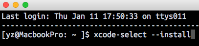
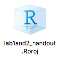

This page lists the week 1 lab session notes and Q&As.

# Notes
If you are going to work on the homework assignment before the next week's lab session, you might want to read the "R environment" and "File path" sections in the handout to understand:

- What are the differences between `console` and `knitr` interpreter sessions. 
- What is the `current working directory`?
- How will the `current working directory` affect file reading and writing?

The "directory of lab 1 and 2 handout" mentioned in the lab handout and slides refers to the directory containing the HTML writeup, but not the "`week1_2_lab_handout_files`" directory in it. 

# Questions and Answers

## Received an error message when installing or importing the "dplyr" package on **MacOS**
Check that `dplyr` is successfully installed by trying to import `dplyr`:

```
library(dplyr)
```

If your installation was successful, there should be no **error**.

If your installation failed, you will receive an error message saying something like `dplyr` is not found. Then, check the error you received when installing `dplyr` by trying to install `dplyr` again:

```
install.packages('dplyr')
```

Go over the printed text in R carefully. If you see an **error** message like "`x-run failed`". You can try fixing it as following:

1. Open "Terminal". It is under your `Applications -> Utilities -> Terminal`. 
2. Copy the following code into the Terminal window and hit "return":

```
xcode-select --install
```

> 

3. Follow the instructions to install.

4. Install the `dplyr` again by running `install.packages("dplyr")`. Check carefully the text printed by R in the console, in order to make sure that there is no error. 

5. Try import `dplyr` again and make sure that no error messages prompted. 

If this does not solve your problem, you can either google the error messages or ask us on Canvas with the error messages. However, be ***careful*** when copying some code online and executing it in your Terminal.

This error occurs because R tries to compile the package from source code, but it cannot find the compiler. "`xcode-select --install`" installs the compiler on MacOS. 

## How to save my work in RStudio and resume later?

After creating an R project, there is a "`.Rproj`" file under the working directory you selected. Open the `.Rproj` file with RStudio to resume your RStudio previous session. 

> 

The `.Rproj` file only keeps track of your current working directory and opened files.

If you want to save your variables as well, the solution depends on whether you are working with the `console` tab or R Markdown file.

- If you are working with the `console` tab, you can save your variables when quiting RStudio by selecting "`save`" workspace image to "`/yourWorkingDir/.RData`". Next time you open the `.Rproj` file, the `.RData` file containing your variables will be loaded by default into the console R interpreter session, and you will be able to access the variables there again. Note that you still need to import the libraries. 

- If you are working with your R Markdown file, you do not need to save your variables in the "console" R interpreter session. This is because everytime you click "`knit`", all your code chunks from beginning to the end will be executed in a new R interpreter session. To get more details, read the "R environment" section in the handout.
